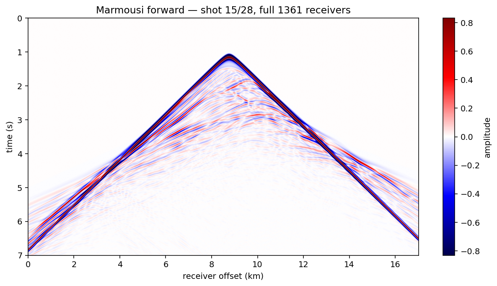
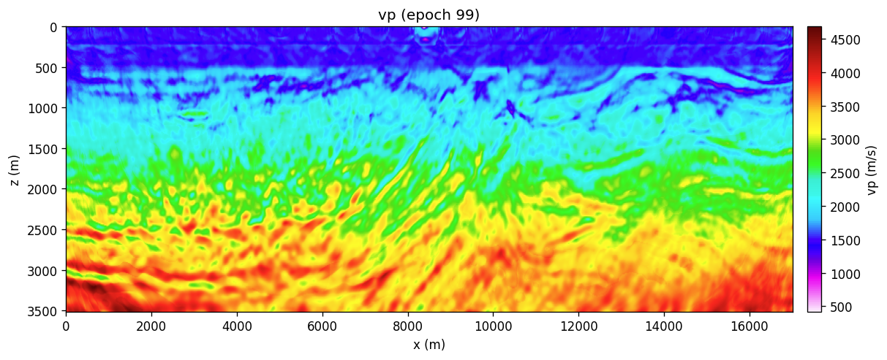
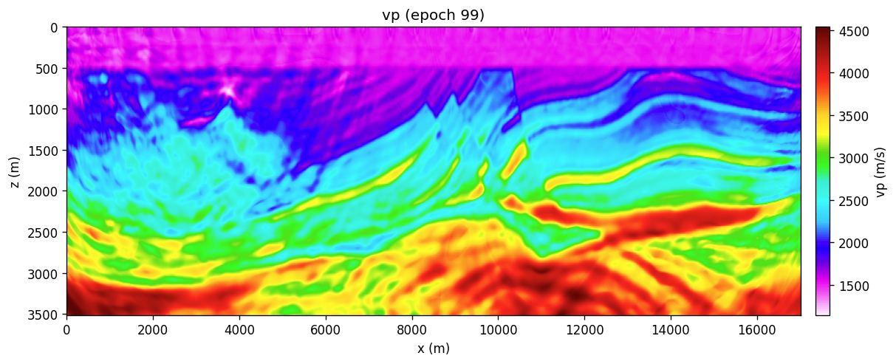
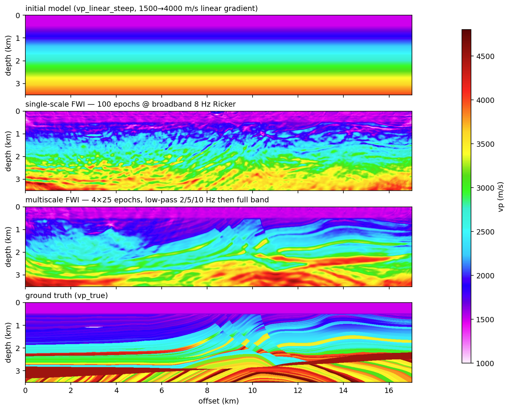
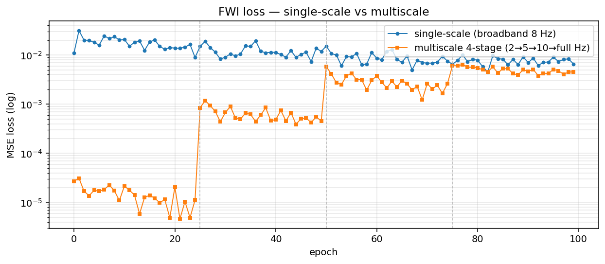

# Marmousi 2-D — sweep-tasks getting started

A 5-minute, three-step walkthrough of **how the sweep-tasks pipeline
works** on a synthetic benchmark. The Marmousi-II velocity model
(281 × 1361 cells at 12.5 m) is embedded in `sweep.datasets` — no
external downloads, no SEG-Y, no environment-specific paths.

```
prep → forward → fwi   (each step = one YAML, one CLI invocation)
```

The goal here is to show **what a sweep-tasks run looks like end-to-end**:
how the YAML drives the solver, where outputs land, what kind of QC
the runner produces. The walkthrough exercises a single-scale and a
multiscale FWI variant so the schema features that matter for
production runs (`stages:`, `bandpass:`, `backend.cuda_options`) all
show up.

---

## Prerequisites

```bash
pip install sweep-tasks    # also pulls sweep + pydantic + torch + yaml
```

That is the whole setup. The velocity models are read straight out of
`sweep.datasets` (`marmousi:2d-demo`, embedded in the package), so there is
nothing to download and no work directory to point at.

A CUDA GPU is recommended — the templates default to `backend.impl: c`
(sweep's fused CUDA kernels). On CPU-only machines flip to
`backend.impl: eager` and expect ~30× the wall time.

---

## The velocity presets

`ModelRef.dataset` names a `sweep.datasets` entry directly in the YAML, and
`preset` picks which model within it:

| preset | role |
|---|---|
| `vp_true`   | true Marmousi-II vp — used to synthesise obs |
| `vp_smooth` | low-pass-smoothed true model — the easy FWI start used by Step 2 |
| `vp_linear` | 1-D linear gradient, zero lateral structure — the cycle-skip stress test used by Step 3 |

`sweep datasets list` prints the full catalogue.

---

## Step 1 — forward modelling

```bash
sweep-tasks run examples/synthetic/01_forward_marmousi.yaml
```

Propagates an 8 Hz Ricker through `vp_true.npy` with 28 sources along
the surface and 1361 streamer receivers, recording 7 s at dt=1 ms.

**Reference wall-clock** (RTX 6000 Ada, `impl: c`): **~2.5 s**.

The YAML in 6 keys:

```yaml
task_type: forward
grid:     { dh: 12.5 }
time:     { dt: 0.001, nt: 7000 }
wavelet:  { kind: ricker, fm: 8.0, delay: 1.0 }
geometry: { kind: line, sources: { step: 50, depth: 1 }, receivers: { step: 1, depth: 18 } }
backend:  { impl: c }
models:
  - { name: vp, dataset: marmousi:2d-demo, preset: vp_true }
```

A sample shot (mid-survey, all 1361 receivers):



Outputs land under `./sweep_runs/forward_marmousi/`:

```
output/
├── record.npy      (28, 7000, 1361, 1)  float32 — synthetic obs
├── sources.npy     shot positions
└── receivers.npy   receiver positions per shot
status.json          {"state": "success", ...}
```

---

## Step 2 — FWI (single-scale)

```bash
sweep-tasks run examples/synthetic/02_fwi_marmousi_single.yaml
```

100 Adam epochs from `vp_linear_steep.npy`, broadband 8 Hz Ricker
source, constant LR. The runner generates the obs internally from
`vp_true.npy` (`obs.synthetic_from`), so Step 1 is *not* a hard
prerequisite — you can run Step 2 standalone.

**Reference wall-clock**: **~2 min**.

Key knobs added on top of Step 1's YAML:

```yaml
task_type: fwi
init_model: { name: vp, dataset: marmousi:2d-demo, preset: vp_smooth }
obs:
  synthetic_from: { name: vp, dataset: marmousi:2d-demo, preset: vp_true }
optimizer: { kind: adam, lr: 25.0 }
loss:      { kind: mse }                    # alt: l1, huber, trace_cosine
backend:
  impl: c
  cuda_options:
    memory:
      strategy: boundary       # exact-adjoint boundary-saving wavefield storage
      boundary: { storage: gpu }
epochs: 100
batchsize: 4
qc:
  every_n_epochs: 9999         # QC only fires at epoch 0 + final epoch
  vp_png: true
  shot_gather: true
  loss_curve: true
```

Final inverted vp:



Outputs land under `./sweep_runs/fwi_marmousi_single/`:

```
output/
├── inverted_vp.npy        final velocity
├── loss.npy / loss.png    loss history
└── epochs/vp_epoch_NNNN.npy   periodic snapshots (every show_every)
qc/
├── vp/iter_NNNN.png       velocity colourmaps
├── shot_gather/iter_NNNN.png  4-panel obs vs syn + spectrum
├── vp_diff/iter_NNNN.png  Δvp = current − initial
└── loss_curve.png
checkpoint.pt              full state for resume
logs/
status.json
```

---

## Step 3 — FWI (multiscale)

```bash
sweep-tasks run examples/synthetic/03_fwi_marmousi_multiscale.yaml
```

Same setup with a `stages:` block — 4 frequency-continuation stages
(Bunks 1995 recipe: low-pass the data to 2 Hz → 5 Hz → 10 Hz, then
release the bandpass for a fourth broadband stage; 25 epochs each).

**Reference wall-clock**: **~2 min** (same ballpark as single-scale; the extra per-stage CPU work has been moved to a GPU FFT zero-phase Butterworth, so stage transitions cost <1 s each).

The relevant YAML delta:

```yaml
stages:
  - { epochs: 25, bandpass: { lo_hz: 0.5, hi_hz: 2.0,  target: wavelet }, lr_scale: 1.0 }
  - { epochs: 25, bandpass: { lo_hz: 0.5, hi_hz: 5.0,  target: wavelet }, lr_scale: 0.7 }
  - { epochs: 25, bandpass: { lo_hz: 0.5, hi_hz: 10.0, target: wavelet }, lr_scale: 0.4 }
  - { epochs: 25,                                                         lr_scale: 0.2 }   # no bandpass — full broadband
```

Final inverted vp:



Side-by-side with the initial model and ground truth (single panel per
row, identical colour bar):



Loss curves (dashed lines mark stage transitions in the multiscale
run):



---

## Reproducibility

All three tasks share the same grid, time grid, and geometry, so they
compose freely. The canonical 5-line run:

```bash
sweep-tasks run examples/synthetic/01_forward_marmousi.yaml
sweep-tasks run examples/synthetic/02_fwi_marmousi_single.yaml
sweep-tasks run examples/synthetic/03_fwi_marmousi_multiscale.yaml
```

Multi-GPU: append `--nproc-per-node N` to any `run` invocation. The
runner re-execs under `torchrun` and shot-parallelises the batch.

Diagnostics: set `SWEEP_TASKS_TPROF=1` before the run for a
millisecond-level per-iter breakdown (zero_grad / forward / bandpass /
obs-H2D / loss / backward / item / snapshot-D2H / reduce / opt.step),
useful for profiling new hardware or new YAML configurations.

---

## Customising your own run

Every parameter has a one-line annotation in the bundled templates;
start from there and edit:

```bash
sweep-tasks init forward -o my_forward.yaml
sweep-tasks init fwi     -o my_fwi.yaml
sweep-tasks init rtm     -o my_rtm.yaml
sweep-tasks run my_fwi.yaml
```

Larger Marmousi-class runs typically want:

- `batchsize: 28` (full batch, with `train_shot_batchsize: 4` to keep
  per-launch memory low)
- more epochs per multiscale stage (200+ for crisp layer recovery)
- the SIREN + hash-grid `reparam:` block from `sweep-tasks init fwi`
  for regularised inversion

See [`docs/datasets/viking/README.md`](../viking/README.md) for the
2-D streamer / field-data flow (build-index → build-plan → wavelet
estimation → FWI / RTM).
