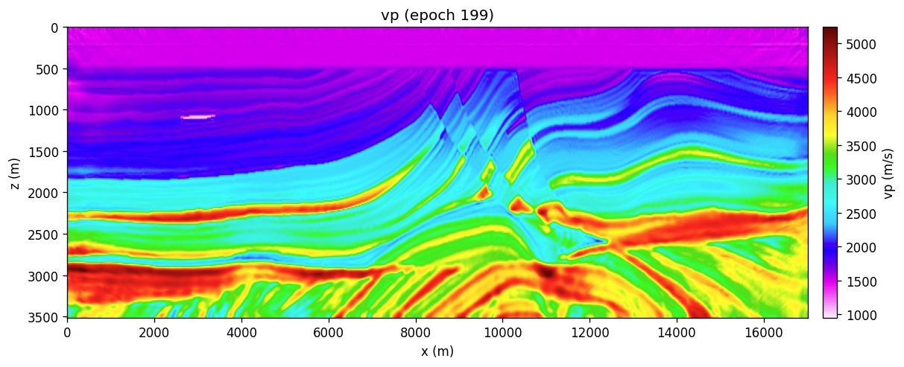
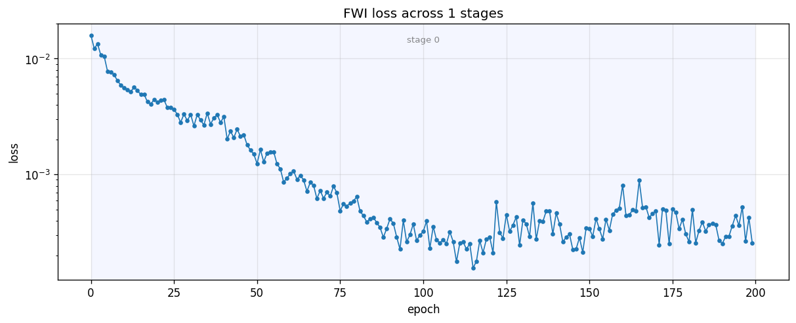
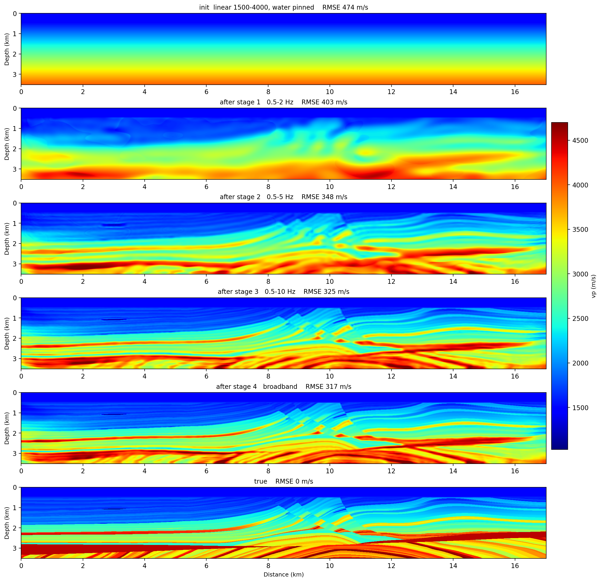

# Marmousi 2-D — sweep-tasks getting started

A walkthrough of **how the sweep-tasks pipeline works**, on a synthetic
benchmark. The Marmousi-II velocity model (281 × 1361 cells at 12.5 m) is
embedded in `sweep.datasets`, so there is nothing to download, no SEG-Y, and
no environment-specific path.

```
forward → FWI (easy start) → FWI (cold 1-D start, multiscale)
        → imaging (RTM, LSRTM) → wavefield snapshots
        → the model as a network (iFWI) → the adjoint-memory ladder
        → frequency-selection FWI (no wavelet at all)
```

Every step is one YAML and one command — except the last, which is three,
for a reason its own section explains. The reference numbers and figures below
come from actually running them, so you can check your own run against
something.

Two examples are not steps in this pipeline and are worth reading first if any
field below is unfamiliar: **09** is the smallest task there is (one shot, a
constant-velocity box) and annotates every field in a task YAML, and **10**
covers the geometry kinds. Neither needs a GPU or a dataset.

---

## Prerequisites

```bash
pip install sweep-tasks    # also pulls sweep + pydantic + torch + yaml
```

That is the whole setup. A CUDA GPU is recommended — the examples default to
`backend.impl: c` (sweep's fused CUDA kernels). On a CPU-only machine flip to
`backend.impl: eager` and expect roughly 30× the wall time.

## The velocity presets

`ModelRef.dataset` names a `sweep.datasets` entry directly in the YAML and
`preset` picks the model within it:

| preset | role |
|---|---|
| `vp_true` | true Marmousi-II vp — used to synthesise obs |
| `vp_smooth` | low-pass-smoothed true model — the easy FWI start (Step 2) |
| `vp_linear` | 1-D gradient, zero lateral structure |

Step 3 deliberately does **not** use `vp_linear`. It builds its own 1-D ramp
with `ModelRef.linear_gradient`, because the preset gets the water column
wrong (it ramps to 1797 m/s where Marmousi is a flat 1500) and caps at
3812 m/s, below the true deep section. `sweep datasets list` shows the full
catalogue.

---

## Step 1 — forward modelling

```bash
sweep-tasks run examples/synthetic/01_forward_marmousi.yaml
```

Propagates an 8 Hz Ricker through `vp_true` with 114 shots at 150 m and a
1361-channel fixed spread, recording 10 s at dt = 1 ms.

**Reference (RTX 6000 Ada, seed 0): 34 s.** `output/record.npy` is
`(114, 10000, 1361, 1)`.

Two properties of this acquisition drive the choices in Steps 2–3:

* **obs dominant frequency is 7.10 Hz**, not the source's 8 Hz — propagation
  and geometric spreading shift the peak down. Half a period is 70 ms.
* **the latest first break lands at 8.59 s** of the 10 s record. A 7 s record
  (the obvious first guess) cut the far offsets off *right after* their first
  arrival: 31.7 % of the edge shots' traces kept under 1 s of coda. At 10 s
  that figure is 0 %.

---

## Step 2 — FWI from a smoothed start

```bash
sweep-tasks run examples/synthetic/02_fwi_marmousi_single.yaml
```

`vp_smooth` keeps the right depth trend, so a **single broadband band**
converges without cycle-skipping. Read this one first: it shows the FWI task
shape, `obs.synthetic_from`, the boundary-saving adjoint and the per-epoch QC
without the multiscale machinery on top.

**Reference (RTX 6000 Ada, seed 0), 200 epochs, 29.6 min:**

| | |
|---|---|
| misfit | 1.592e-02 → 1.564e-04 (min, epoch 115) → 2.575e-04 |
| RMSE vs true | 357.3 (init) → **270.6** |
| perturbation correlation `r` | 0.700 |





The runner's obs/syn QC panel — interleaved gathers, the acquisition map, and
a receiver-averaged amplitude spectrum where obs and syn sit on top of each
other:


> **`batchsize` is a fraction, not a count.** It is how many shots are drawn
> at random per optimizer step, so what matters is `batchsize / nshots`. Keep
> it near ~15 %. Measured here: 114 shots with `batchsize: 8` (7 %) gives RMSE
> 297, and `batchsize: 16` (14 %) gives 271 — denser shots only pay off if the
> batch grows with them.

---

## Step 3 — FWI from a cold 1-D start, with frequency continuation

```bash
sweep-tasks run examples/synthetic/03_fwi_marmousi_multiscale.yaml
```

Same grid, geometry and wavelet as Steps 1–2. What changes is the **start**: a
1-D ramp with no lateral structure whatsoever, so nothing about the answer
leaks in through the model. A single broadband band cycle-skips from there;
the four-stage ladder (2 → 5 → 10 Hz → broadband, 50 epochs each) is what
makes it work.

**Reference (RTX 6000 Ada, seed 0), 4 × 50 epochs, 11.5 min:**

| after | RMSE vs true |
|---|---|
| init (1-D ramp 1500→4000, water pinned) | 473.7 |
| stage 1 — 0.5–2 Hz | 402.6 |
| stage 2 — 0.5–5 Hz | 347.6 |
| stage 3 — 0.5–10 Hz | 325.3 |
| stage 4 — broadband | **317.3** |

perturbation correlation `r` = 0.752; low-wavenumber RMSE (both smoothed by
σ = 8 cells) 184.9, a **42.5 % improvement** on the starting model.




### Why those rungs

The ladder is not a magic sequence. A stage cycle-skips where the two-way
traveltime error exceeds half a period, so the next rung must satisfy

```
f  <  1 / (2 |Δt|)
```

Measured on this setup, the 1-D start is **−160 ms** off at 2 km depth in the
flat-layered left half of the model. That forces the first rung below 3.1 Hz —
2 Hz here. One 2 Hz stage pulls the error down to about −50 ms, which clears
5 Hz (100 ms half-period), and so on up. Jumping straight from the 1-D start
to 5 Hz reproducibly wrecks the left half, while the right half — which starts
only +65 ms off — converges fine either way.

Two consequences worth internalising:

* **RMSE against the true model is a poor progress metric here.** It is
  dominated by thin-layer amplitudes FWI cannot resolve. Traveltime error and
  the perturbation correlation `r` track what the inversion is actually doing;
  RMSE rose through the stages in several configurations that were visibly
  improving the background.
* **A single 1-D gradient cannot suit both halves of Marmousi.** The left half
  wants a slower start, the right half a faster one, and `|Δt_left| +
  |Δt_right|` at 2 km is invariant (255 ms) whatever `vmax` you choose.
  Raising it only moves error from one half to the other.

---

## Step 4 — the model as a network (iFWI)

```bash
sweep-tasks run examples/synthetic/07_fwi_marmousi_inr.yaml
```

Same physics, same data, different **unknowns**. Instead of 382,441 velocity
cells, the unknowns are the 251,728 weights of a coordinate network — a hash
encoder feeding a SIREN — that is asked for `vp(x, z)` wherever the solver
needs it. The optimiser trains the weights; the network's own smoothness is the
regulariser.

It starts from `vp_smooth`, the same start as Step 2, so the two are directly
comparable.

**Reference (RTX 6000 Ada, seed 0), 4 × 50 epochs, 13.9 min:**

| | grid (Step 2) | network (Step 4) |
|---|---|---|
| RMSE vs true | **270.6** | 267.3 |
| perturbation `r` | 0.700 | 0.687 |
| free parameters | 382,441 cells | **251,728 weights** |

A wash on accuracy, which is the honest result. What the parametrisation buys
is a model with fewer degrees of freedom than the grid it renders onto.

### The one parameter that decides whether it works

`reparam.vp_std`. The network renders `vp = init + raw * vp_std`, and `raw`
grows only as fast as `lr × steps` lets it — so `vp_std` is the effective step
size in m/s, and `lr` is not. Size it to the perturbation **the data needs**,
not to an intuition about small perturbations. Here the true update has rms
357 m/s and a range of ±1400:

| `vp_std` | 300 | 600 | 900 | 1500 | 2500 | 4000 |
|---|---|---|---|---|---|---|
| RMSE | 325.4 | 309.3 | 291.8 | 276.9 | **267.3** | 264.2 |
| `r` | 0.467 | 0.543 | 0.609 | 0.659 | **0.687** | 0.696 |

At 300 — the obvious first guess — the network saturates at ±180 m/s of update
against the ±1400 the data is asking for, and the deep section barely moves
(RMSE improves 1.2 % below 2.5 km). The curve flattens around 2500.

---

## Step 5 — imaging at a fixed velocity: RTM and LSRTM

```bash
sweep-tasks run examples/synthetic/04_rtm_marmousi.yaml
sweep-tasks run examples/synthetic/05_lsrtm_marmousi.yaml
```

Steps 2–4 solve for velocity. These two hold it fixed at `vp_smooth` and ask a
different question: **where are the reflectors?**

| | what it solves | passes | reference (RTX 6000 Ada, seed 0) |
|---|---|---|---|
| 04 RTM | nothing — one adjoint pass | 1 | 164 s |
| 05 LSRTM | reflectivity, linear in the unknown | 20 epochs | 89 s, misfit 1.458e-2 → 1.374e-2 |

RTM cross-correlates the source wavefield with the back-propagated residual and
stacks over shots. It is fast and it is *not* an inversion, so the image carries
the acquisition footprint and the source signature. LSRTM iterates on that image
until the demigrated data matches the observed scattered field — same physics,
but deconvolved and better balanced. Neither touches the non-linearity that
makes FWI hard, because the background velocity never moves.

04 writes its image three ways — raw, illumination-normalised, and per-shot
normalised — plus a depth-tapered Laplacian post-filter applied to each, so you
can see what each knob does rather than take it on trust. That is why the
output directory has twenty files for one run.

> **The LSRTM misfit is not monotone**, and that is expected rather than a bug:
> epochs 0 / 9 / 19 read 1.458e-2 / 1.393e-2 / 1.505e-2 before settling at
> 1.374e-2. The shot batch is redrawn every step, so consecutive epochs are
> measured on different data.

---

## Step 6 — what the physics and backend knobs actually do

```bash
sweep-tasks run examples/synthetic/06_wavefield_snapshots.yaml
sweep-tasks run examples/synthetic/08_fwi_marmousi_backends.yaml
```

**06** dumps the pressure field at chosen time steps instead of only recording
at receivers — the fastest way to see a physics flag rather than reason about
it. With `free_surface: true` the snapshots show the downgoing wave, its
polarity-flipped ghost, and the surface multiples behind it; set it to `false`
and re-run and only the direct wavefront is left. **Reference: 18 s**, snapshots
at steps 400 / 900 / 1500 / 2400.

**08** is the same FWI as Step 2 cut to 10 epochs, with every `backend:` variant
written out and commented so you can swap one block at a time and watch wall
time and `nvidia-smi`. **Reference: 43 s** for the default (fused CUDA +
boundary saving). The physics and the gradient are identical across the
variants — only speed and peak memory move:

| `cuda_options.memory.strategy` | what it keeps for the adjoint |
|---|---|
| `full` | every time step. Fastest, and out of memory well before a 3-D grid. |
| `boundary` | only the PML-zone slab; the interior is reconstructed backwards. Exact, and the production default. `storage:` sends the slab to `gpu` / `cpu` / `disk`. |
| `ckpt` | gradient checkpointing — recompute instead of store. |

Step 7 below is the case where this stops being an academic choice: at 60500
time steps, `full` needs about 50 GB where `boundary` needs 2.2 GB.

---

## Step 7 — frequency-selection FWI, with no wavelet at all

```bash
RUNS=examples/synthetic/sweep_runs
sweep-tasks run examples/synthetic/11_forward_freqsel_nodes.yaml
sweep-tasks extract-coeff $RUNS/forward_freqsel_nodes --n-p 50000 --k-lo 50 --k-hi 150 -o $RUNS/coeff_1_3hz.npz
sweep-tasks extract-coeff $RUNS/forward_freqsel_nodes --n-p 25000 --k-lo 50 --k-hi 150 -o $RUNS/coeff_2_6hz.npz
sweep-tasks extract-coeff $RUNS/forward_freqsel_nodes --n-p 17000 --k-lo 68 --k-hi 170 -o $RUNS/coeff_4_10hz.npz
sweep-tasks run examples/synthetic/12_fwi_marmousi_freqsel.yaml
```

Three commands rather than one, because this method inverts **pre-extracted
frequency coefficients**, not gathers. Every node of the array radiates its own
comb frequency continuously; the DFT of a steady-state window separates them
exactly, so the whole array rides one forward per iteration with deterministic
zero crosstalk (Tromp & Bachmann, 2019).

The misfit is a per-node complex-cosine coherence, invariant to any per-node
complex scale — which is why there is **no `wavelet:` in the inversion YAML at
all**. Source spectrum, excitation delay and sensor coupling are all complex
scales, and they cancel.

**Reference (RTX 6000 Ada, seed 0), 240 iterations, 11.9 min:**

| after | RMSE vs true |
|---|---|
| init (same 1-D ramp as Step 3) | 473.7 |
| rung 1 — 1–3 Hz | 429.6 |
| rung 2 — 2–6 Hz | 406.5 |
| rung 3 — 4–10 Hz | **397.9** |

`r` = 0.575; low-wavenumber RMSE 321.6 → 243.4.

### Against conventional FWI, at equal cost

|  | solver steps | wall | RMSE | `r` |
|---|---|---|---|---|
| Step 3, conventional | 16.0 M | 11.5 min | **317.3** | **0.752** |
| Step 7, freqsel | 10.5 M | 11.9 min | 397.9 | 0.575 |

Conventional FWI wins here and this walkthrough does not pretend otherwise. On
Marmousi the wavelet is known exactly, so the wavelet-free property is worth
nothing. On a field OBN survey — unknown source signature, unknown per-node
coupling — it is the difference between having a workflow and not.

### Sizing a comb: bins are the currency, not shots

Two relations govern every number in the `frequency:` blocks:

```
bins  =  bandwidth × window length          (window = probe_samples × dt)
pool size  ≤  bins                          (hard constraint)
```

Extra sources ride the **same** forward for free, so the way to fire more nodes
at once is to lengthen the analysis window, which buys bins linearly. Note the
consequence: the window *shortens* as the ladder climbs, because a wider band
reaches the same bin count in less time. The expensive rung is the lowest one.

Two things that cost real runs to learn:

* **Start the ladder low enough.** Step 3's criterion applies unchanged: this
  1-D start is −160 ms off at 2 km, so the first rung must sit below 3.1 Hz. A
  2–4 Hz first rung rides that line and reproducibly fails — it drove the model
  *away* from the truth (RMSE 473.7 → 520.8) while the misfit fell 3.2×.
* **Size the PML by the longest wavelength, not by habit.** At 1 Hz the
  wavelength is ~1500 m and the default `abcn: 20` is only 250 m — λ/6. A
  continuous-wave field in a leaky box builds standing waves, and unlike a
  transient that does *not* cancel between a transient obs and a steady-state
  syn. `abcn: 40` puts the 1–3 Hz rung's steady-state check at 5.9e-3; the
  runner prints that number at every stage entry and the target is ≤ 1e-2.

Extraction is a DTFT of a record that already exists, so one forward feeds the
whole ladder — the Ricker in Step 7's forward is `fm: 5.0`, chosen to cover
1–10 Hz rather than to peak on the first rung.

### The same thing in 3-D

Examples **13** + **14** run this pipeline on SEG/EAGE Overthrust (201 × 201 ×
47 at 100 m), 64 nodes fired together out of 65 bins. **35 min**, RMSE 644.1 →
512.3, `r` = 0.309. The thrust structure comes out in the right place; the
result is also visibly smooth.

That smoothness is worth understanding because it is not a tuning failure. The
grid caps the band: 2179 m/s at 100 m cells puts five points per wavelength at
**4.4 Hz**, and 2–4 Hz at 4000 m/s is a 1–2 km wavelength, so half-wavelength
resolution is 500 m – 1 km against tens of metres of true layering. Where the
2-D ladder climbs to 10 Hz on a 12.5 m grid, this one has nowhere to go. The
only lever is a finer grid — `downsample: 2` doubles the ceiling and costs
about 16× per iteration, which is a multi-GPU job rather than an example.

A cold start matters even more here than in Step 3, for a reason that is easy
to get backwards. Starting 14 from `smooth_sigma_cells: 6` — the standard-looking
choice — makes the example **badly posed**: 600 m of smoothing is already
correct everywhere a 1–4 Hz band can see, so there is nothing to gain and the
run degraded a good model (RMSE 402.6 → 431.5). The 1-D ramp it uses instead
leaves real low-wavenumber error (503.0) for those frequencies to work on.

14 also needs a **≥ 48 GB GPU** as written: the first rung's 64 s analysis
window is 19250 time steps and peaks at 43.8 GB even with boundary saving.

---

## Checking your own run

Everything above is reproducible: `seed` is set explicitly in each YAML, the
models come from the embedded dataset, and two runs of the same file on the
same machine come out **bit-identical** (verified — matching misfit to every
digit, max model difference 0.0 m/s).

Each run directory is self-describing:

```
sweep_runs/<task_id>/
  config_resolved.yaml     every default filled in — the exact spec that ran
  run_meta.json            host, CUDA, package versions, git state
  output/initial_vp.npy    the resolved STARTING model
  output/inverted_vp.npy   the result
  output/loss.npy          misfit per epoch
  output/epochs/           per-`show_every` model snapshots
  qc/                      vp, vp_diff, shot_gather, loss_curve figures
```

`output/initial_vp.npy` matters when the start is built in memory
(`dataset:` or `linear_gradient:`): there is no input file to point at
afterwards, so the runner writes the resolved array before training begins.

**Scope of "reproducible":** bit-identical is a same-machine, same-build
claim. A different GPU model or a rebuilt CUDA extension can reorder floating
point atomics, so expect last-digit differences there. The numbers above
should still land within a fraction of a percent, and none of the conclusions
move.
