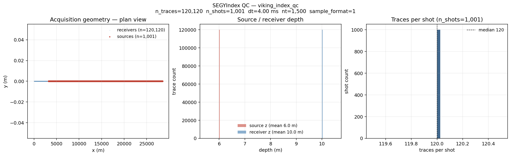
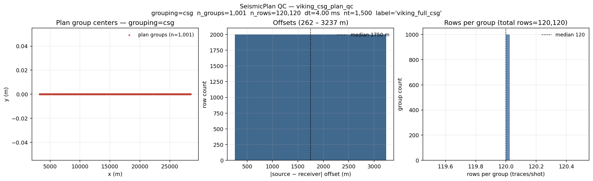
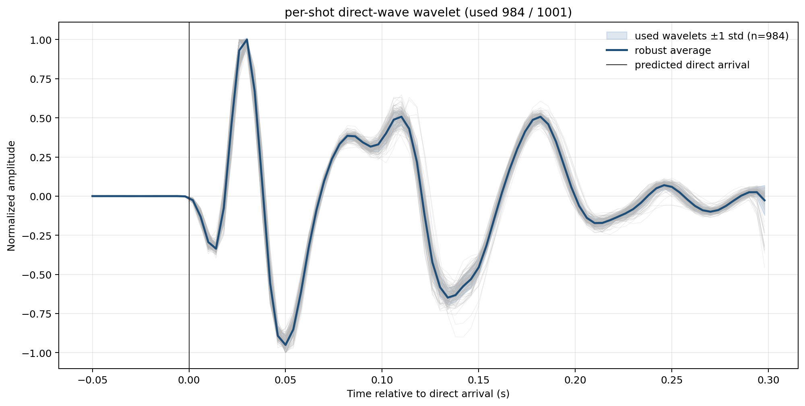
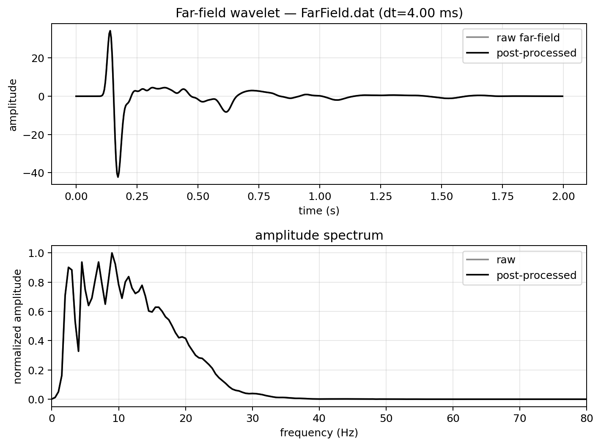

# Viking 2-D — end-to-end example

Reproduces the **Mobil AVO Viking Graben (line 12)** FWI + RTM result
with the sweep-tasks CLI, starting from the public S3 download and
ending at a filtered RTM image. The walkthrough below assumes you are
running **locally on a single workstation with one GPU** — no SLURM,
no cluster filesystem layout. A short [§ Running on a cluster
(optional)](#running-on-a-cluster-optional) appendix at the end shows
the ibex-style sbatch entry points if you want them.

```
download → build-index → build-plan ┐
                                     ├─ wavelet (legacy) ┐
                                     └─ initial model (legacy) ┤
                                                                └─ FWI → RTM → filter-image
```

The end-to-end pipeline matches the legacy `fwi_workflow-dev`
reference number-for-number. Indexing, plan-building, wavelet
estimation (rank-1 average + SIREN/sweep refinement), FWI, RTM, and
the depth-tapered post-filter all live inside `sweep-tasks`; only the
**initial velocity model** builder is still served by a legacy
script (TODO: port, see [§ Roadmap](#roadmap)).

## Visual tour — what each step produces

**Every** `sweep-tasks` command in the pipeline writes at least one
preview PNG by default (use `--no-qc-png` or `--no-plot` to disable).
Only the steps verified end-to-end against the Viking dataset are
shown below; the remaining steps (3b, 3d, 4, 5, 6, 7) will be added
once a clean reference run is captured.

| Step | One-line product | Visual |
|---|---|---|
| 1 `build-index`         | SEG-Y per-trace catalog (3-panel geometry QC) |  |
| 2 `build-plan`          | Filtered + grouped plan (3-panel filter QC)   |  |
| 3a `analyze-wavelet`    | Robust direct-wave average across all shots   |  |
| 3c `convert-farfield`   | Far-field signature (QC reference)            |  |

---

## Prerequisites

1. **Sweep installed.** From a checkout of this repo:

   ```bash
   pip install -e sweep            # propagator
   pip install -e sweep-io         # SEG-Y readers, SeismicPlan
   pip install -e sweep-tasks      # the CLI entry points used below
   ```

2. **One CUDA-capable GPU.** Anything with ≥ 16 GB works for Viking
   at the 12.5 m grid (24 GB recommended for the full 6-stage ladder).
   Sanity check:

   ```bash
   python -c "import torch; print(torch.cuda.is_available(), torch.cuda.get_device_name(0))"
   ```

3. **Working directory.** Pick one writable folder for the whole
   pipeline; the doc uses `$VIKING_HOME` everywhere. Around 5 GB free
   is plenty (SEG-Y 1.4 GB + outputs ~3 GB).

   ```bash
   export VIKING_HOME=$HOME/viking          # change to taste
   mkdir -p $VIKING_HOME/{raw,run}
   ```

   - `$VIKING_HOME/raw` will hold the downloaded SEG-Y + far-field.
   - `$VIKING_HOME/run` will hold the index, the plan, FWI / RTM
     outputs.

That's all the environment setup. No `SWEEP_*_ROOT` / `PROJECT_DATA_ROOT`
exports are needed for local single-GPU runs — those variables only
matter for the cluster sbatch templates discussed at the bottom of
this file.

### One file drives every step — `sweep-tasks init viking`

Every command in Steps 1–3d below accepts **either** a forest of CLI
flags **or** `--config viking.yaml` (one YAML, sections per step).
This is the recommended path — no 30-flag invocations to remember.
Generate the starter config with `sweep-tasks init`:

```bash
sweep-tasks init -o $VIKING_HOME/viking.yaml
# wrote 'viking' template -> /home/you/viking/viking.yaml
# next: edit the paths inside (especially $VIKING_HOME / $HOME), then run:
#        sweep-tasks build-index --config /home/you/viking/viking.yaml
```

(`sweep-tasks init --list` shows what's bundled. Three templates ship
today: `viking` (wavelet pipeline, default), `fwi` (FWI task YAML
for `sweep-tasks run`), `rtm` (RTM task YAML). Run without `-o` to
dump to stdout and pipe / edit directly.)

The generated YAML has one section per subcommand (`build_index:`,
`build_plan:`, `analyze_wavelet:`, `estimate_wavelet:`,
`convert_farfield:`, `plot_wavelet_steps:`) plus a `common:` block
for shared defaults. **All paths inside use `$VIKING_HOME`** so
once that env var is set the file is usable as-is. Open the file
and adjust any value you want different from the canonical Viking
defaults; saving / re-running is enough — no re-init needed.

**CLI flags override YAML**, so you can adjust one knob at a time
without editing the file:

```bash
sweep-tasks analyze-wavelet --config $VIKING_HOME/viking.yaml --shot-stop 50
```

The step-by-step sections below show the `--config` form as the
primary command and list the full CLI alternative when relevant.

---

## Step 0 — Download the public dataset

The data lives in the SEG open-data S3 bucket:

> <http://s3.amazonaws.com/open.source.geoscience/open_data/Mobil_Avo_Viking_Graben_Line_12/mobil_avo.html>

```bash
cd $VIKING_HOME/raw

BASE=https://s3.amazonaws.com/open.source.geoscience/open_data/Mobil_Avo_Viking_Graben_Line_12

# Pre-stack SEG-Y (~1.4 GB) — the only file FWI / RTM strictly need.
curl -fL -O ${BASE}/seismic.segy

# Far-field source signature (ASCII, one sample per line; dt = 4 ms).
curl -fL -O ${BASE}/Farfield.dat

# Optional auxiliary material.
curl -fL -O ${BASE}/mobil_wellogs.tar.gz           # well logs (LIS)
curl -fL -O ${BASE}/Mobil_migration_well_logs.pdf  # wellog plots
curl -fL -O ${BASE}/284E_frontmatter.pdf           # SEG Open Pub No. 4 front matter
curl -fL -O ${BASE}/README.txt
curl -fL -O ${BASE}/sufirst.job
curl -fL -O ${BASE}/FarField.jpg
```

Sanity-check the bundle:

```bash
ls -lh seismic.segy                      # ~1.4 GB
sha1sum seismic.segy Farfield.dat
```

### What's in `seismic.segy`

| Field | Value |
| --- | --- |
| Trace count | 120,120 (1001 shots × 120 channels) |
| Samples / trace | 1500 |
| Sample interval | 4 ms |
| Record length | 6.0 s |
| Sample format | 1 (IBM 32-bit float) |
| FFID range | 3 to 1003 |
| Shot interval | 25 m |
| Group interval | 25 m |
| Offset range | -262 m (near) to -3,237 m (far) |
| Source x | 3,237 to 28,512 m |
| Receiver x | 0 to 28,250 m |

`sy = gy = 0` for every trace — the line is genuinely 2-D in x. SEG-Y
coordinate scalar = 1 (so `sx, sy, gx, gy` are already metres) and
coord-units = 3 (m). **Source / receiver depth bytes are zero**, so
Step 1 below injects the canonical Viking acquisition constants:
airgun array at **6 m**, streamer at **10 m**.

---

## Step 1 — `sweep-tasks build-index`

Scans every SEG-Y trace header in parallel and writes a tiny
per-trace catalog. Run **once**; the same index serves every plan
you build later.

```bash
sweep-tasks build-index --config $VIKING_HOME/viking.yaml
```

Or, equivalently, all-CLI:

```bash
sweep-tasks build-index \
    --segy-root  $VIKING_HOME/raw \
    --glob       'seismic.segy' \
    --out        $VIKING_HOME/run/viking_index.npz \
    --num-workers 8 \
    --source-depth-m   6.0 --receiver-depth-m 10.0 \
    --progress
```

`--num-workers 8` finishes Viking in ~10 s on a laptop CPU; bump it
to whatever your machine has. (The `-n N` MPI shortcut covered in
[`docs/cli_workflow.md`](../../cli_workflow.md) is for much larger
3-D surveys — Viking does not need it.)

**Console output (measured on Viking)**

```
[build-index] scanning 1 SEG-Y files under /…/viking/raw (glob='seismic.segy'; threads=8)
  scanned seismic.segy  (file_id=0, traces=120120)
[build-index] scan complete: 120,120 traces across 1 files, dt=0.004s nt=1500, wall=0.5s
[build-index] wrote /…/viking_index.npz (0.3 MB)
[build-index] QC PNG -> /…/viking_index_qc.png
```

Wall time end-to-end (process startup + scan + npz + PNG): **~5 s**.

**Outputs**

- `$VIKING_HOME/run/viking_index.npz` (~300 KB) — per-trace `file_id`,
  `byte_offset`, `ffid`, `sx/sy/sz`, `gx/gy/gz`. `source_depth_m` and
  `receiver_depth_m` arrays are constant at 6 m / 10 m (overrides).
- `viking_index_qc.png` (~100 KB) — 3-panel acquisition geometry
  preview (pass `--no-qc-png` to skip).

The QC PNG (see Visual tour above) is a 3-panel preview: plan-view
(sources red, receivers blue — Viking is a 2-D line so both
collapse to single tracks along x); source & receiver depth
histograms (sharp peaks at 6 m / 10 m — the constants we injected
via `--source-depth-m` / `--receiver-depth-m`); per-shot trace-count
histogram (perfectly flat 120 traces × 1001 shots).

Verify programmatically with:

```python
>>> from sweep_io.segy_index import SEGYIndex
>>> idx = SEGYIndex.load("$VIKING_HOME/run/viking_index.npz")
>>> idx.n_traces, idx.dt_s, idx.samples_per_trace
(120120, 0.004, 1500)
```

---

## Step 2 — `sweep-tasks build-plan`

Filters + groups the index into a `seismic_plan_v1` npz that declares
**exactly which trace bytes FWI will read**. Plans are cheap to rebuild
— iterate freely on shot subsets, offset windows, sub-sampling, etc.

### Full CSG plan (all 1001 shots × 120 receivers)

```bash
sweep-tasks build-plan --config $VIKING_HOME/viking.yaml
```

Or all-CLI:

```bash
sweep-tasks build-plan \
    --index    $VIKING_HOME/run/viking_index.npz \
    --grouping csg \
    --out      $VIKING_HOME/run/viking_csg_plan.npz \
    --label    "viking_full_csg"
```

### 3 km offset cap (for the RTM in Step 6)

```bash
sweep-tasks build-plan \
    --index         $VIKING_HOME/run/viking_index.npz \
    --grouping      csg \
    --offset-max-m  3000 \
    --out           $VIKING_HOME/run/viking_csg_3km.npz \
    --label         "viking_csg_offset_le_3000m"
```

Each `build-plan` invocation also writes `<out>_qc.png` next to the
npz (pass `--no-qc-png` to skip). The PNG shows *what survived your
filters* in three panels: group-center scatter (with **dropped
groups underlaid in gray** when an `--index` is supplied), per-row
offset histogram, and rows-per-group histogram. See the Visual tour
thumbnail at the top.

#### Inspect programmatically

```bash
python -c "from sweep_io.seismic_plan import SeismicPlan; \
           p=SeismicPlan.load('$VIKING_HOME/run/viking_csg_plan.npz'); \
           print(p.grouping, p.n_groups, p.n_rows); print(p.build_meta)"
```

Real output on Viking (full CSG plan):

```
csg 1001 120120
{'build_meta': 'viking_full_csg', 'index_hash': '…', 'filters': {}}
```

i.e. **1,001 CSG groups (shots) × 120 traces each = 120,120 rows**.

Full Viking CSG ~8 MB; offset-capped variants smaller. The plan
carries all four things FWI needs — `row_source_xyz`,
`row_receiver_xyz`, `row_file_id`, `row_trace_offset` — so Steps 3-6
never touch the raw SEG-Y header again.

---

## Step 3 — Source wavelet

The wavelet that the FWI / RTM YAMLs reference is produced by a
**two-stage chain**:

```
3a. rank-1 robust direct-wave average
       (per-shot estimate × 1001 shots → polarity-aligned → robust mean)
              │   average_direct_wavelet.npz
              ▼
3b. SIREN LBFGS prefit + sweep wave-equation refinement
       (SIREN MLP fits 3a, then refines via Acoustic forward solve)
              │   estimated_wavelet.npz   ← feeds FWI / RTM
              ▼
Optional: FarField.dat ASCII → npz (for QC comparison) ; 4-step pipeline plot
```

All four sub-stages are native `sweep-tasks` subcommands now:
`analyze-wavelet`, `estimate-wavelet`, `convert-farfield`,
`plot-wavelet-steps`. Input is the CSG `SeismicPlan` you built in
Step 2; output `estimated_wavelet.npz` plugs directly into the
`wavelet:` block of every FWI / RTM YAML in Steps 5 / 6.

### What goes in / what comes out

| Stage | Input | Output | Measured cost on Viking |
|---|---|---|---|
| 3a `analyze-wavelet`      | SeismicPlan + SEG-Y                         | `average_direct_wavelet.npz` | CPU, **~15 s** (1001 shots, 8 threads) |
| 3b `estimate-wavelet`     | SeismicPlan + SEG-Y + 3a's npz              | `estimated_wavelet.npz`      | 1 GPU, ~15-30 min (1001-shot V100 reference) |
| 3c `convert-farfield`     | `Farfield.dat` (ASCII)                      | `farfield_wavelet.npz`       | CPU, **~1 s** |
| 3d `plot-wavelet-steps`   | the 3a/3b/3c npz files                       | 4-panel comparison PNG       | CPU, **~3 s** |

### 3a — rank-1 robust direct-wave average

For each shot in [1..1001] the algorithm:

1. picks the **4 nearest-offset receivers** from the plan (offset is
   `|gx - sx|` per row);
2. reads those four traces from SEG-Y via the plan's row-byte-offsets;
3. computes predicted **direct-arrival times** `τ = |offset| / 1500 m/s`;
4. runs **rank-1 alternation** in a `(-0.05 s, +0.30 s)` window around
   each predicted arrival: alternately solve for one shared wavelet and
   per-trace amplitudes, ~25 iterations, until a single common wavelet
   shape explains all four traces in a least-squares sense;
5. records a **residual-RMS-ratio** per shot (residual ÷ observed within
   the direct window).

After all 1001 per-shot wavelets are estimated:

6. drop shots with `residual_ratio > 0.5` (noise / bad picks);
7. polarity-align the survivors against a preliminary median;
8. drop shots whose **shape correlation to the preliminary mean < 0.95**;
9. **average** the surviving wavelets; produce a causal version
   (zero-pad the leading negative-time samples, peak at `t = 0`).

#### Canonical Viking parameters (used in the reference run)

```yaml
direct_batch:
  shot_start: 1
  shot_stop:  1001
  shot_stride: 1
  nearest_receivers: 4
  water_velocity_m_s: 1500
  rel_t_min_s: -0.05
  rel_t_max_s: 0.30
  iterations: 25
  min_residual_ratio: 0.5
  min_shape_corr_to_average: 0.95
```

#### Command

```bash
sweep-tasks analyze-wavelet --config $VIKING_HOME/viking.yaml
```

The YAML's `analyze_wavelet:` block carries the canonical Viking
parameters shown just above. To override one knob (e.g. test on
fewer shots), pass it on the CLI — overrides win:

```bash
sweep-tasks analyze-wavelet --config $VIKING_HOME/viking.yaml --shot-stop 50
```

Full-CLI form (no YAML) for reference:

```bash
sweep-tasks analyze-wavelet \
    --plan        $VIKING_HOME/run/viking_csg_plan.npz \
    --out-dir     $VIKING_HOME/run/wavelet/direct_batch \
    --shot-start 1 --shot-stop 1001 --shot-stride 1 \
    --nearest-receivers 4 \
    --water-velocity-m-s 1500 \
    --rel-t-min-s -0.05 --rel-t-max-s 0.30 \
    --iterations 25 \
    --min-residual-ratio 0.5 --min-shape-corr-to-average 0.95
```

CPU-only, no GPU needed. **Wall time on Viking 1001 shots: ~15 s
(measured end-to-end on a login node, 8 CPU threads).**

#### Outputs (`analysis/`, `average/`)

- `analysis/wavelet_overlay_mean_std.png` — every shot in light gray,
  ±1σ ribbon in blue, the robust average in dark blue. (This is the
  Visual-tour thumbnail.)
- `analysis/wavelet_spectra_mean_std.png` — amplitude spectrum of the
  same overlay.
- `analysis/wavelet_residual_after_average.png` — per-sample residual
  RMS after subtracting the average; sanity check that the rank-1
  average actually explains each shot.
- `analysis/wavelet_stats.csv` — per-shot residual / shape-corr /
  used-in-average flag.
- `average/average_direct_wavelet.npz` — the robust mean. **This is
  the input to Step 3b.**
- `summary.json`, `command.txt`.

#### Reference numbers (Viking 1001 shots, verified end-to-end with `sweep-tasks analyze-wavelet`)

| metric | value |
|---|---|
| Shots used in robust average | **984 / 1001** |
| Median per-shot residual-ratio | **8.2 %** |
| Median shape-correlation to mean | **0.994** |

Console output for the full run (measured end-to-end):

```
[analyze-wavelet] plan=/…/viking_csg_plan.npz
[analyze-wavelet] output_dir=/…/wavelet/direct_batch
  ...estimated 25 per-shot wavelets so far
  ...estimated 50 per-shot wavelets so far
  ...
  ...estimated 1000 per-shot wavelets so far
per-shot wavelet stack: (1001, 88)
[analyze-wavelet] average_wavelet_npz: …/average/average_direct_wavelet.npz
[analyze-wavelet] summary_json:        …/summary.json

real    0m14.665s
```

The wavelet shows the expected airgun signature — main pulse at
~0.05 s, bubble pulse at ~0.18 s.

### 3b — SIREN LBFGS prefit + sweep wave-equation refinement

3a gives a good average shape from the *direct arrival only* — it
ignores reverberation off the sea surface and the deeper section.
3b refines this in two sub-steps so the wavelet matches the **full
recorded waveform** in the FWI band:

```
   average_direct_wavelet.npz (rank-1; from 3a)
                  │  resample to SIREN time grid
                  ▼
   initial_wavelet_target.npz  ← LBFGS target
                  │  SIREN MLP: coords (-1..1) → wavelet samples
                  │  LBFGS minimise MSE(SIREN(t), target),  10 iter
                  ▼
   prefit_siren_wavelet.npz    ← prefit, matches target to ~1e-9
                  │  sweep Acoustic forward solve (4-shot batch)
                  │  filter obs + syn to 3-30 Hz
                  │  Adam on SIREN params, loss = trace_cosine + 0.05·MSE_prior
                  │  100 epochs (decreases ~9.3e-2 → ~8.1e-3 in 30 epochs)
                  ▼
   estimated_wavelet.npz       ← FEEDS FWI / RTM as wavelet.path
```

Two design choices worth knowing about:

- **Why SIREN?** A SIREN MLP regularises the wavelet to a smooth
  parameterisation that can still capture the bubble pulse without
  fitting noise. Direct sample-space inversion overfits in our
  experience.
- **Why a prior?** The wave-equation loss alone has a near-flat
  direction (an overall time shift in the wavelet trades for a static
  in the velocity model). The `prior_weight: 0.05` term anchors the
  refined SIREN to the rank-1 average across the full band, killing
  that null space without over-constraining the bubble.

#### Canonical Viking parameters

```yaml
wavelet_inversion:
  shot_start: 1
  shot_stop:  1001
  nearest_receivers: 4              # same selection as 3a, larger N is OK
  tmax_s: 6.0
  velocity_m_s: 1500                # background for the 1-D forward grid
  dx_m: 12.5   dz_m: 12.5
  x_padding_m: 500  z_padding_m: 500  model_depth_m: 360
  filter_lowcut_hz: 3.0
  filter_highcut_hz: 30.0
  filter_order: 4
  backend: cuda
  mode: siren
  epochs: 100
  lr: 1.0e-3
  loss_type: trace_cosine
  prefit_steps: 10
  prefit_lr: 1.0e-3
  initial_wavelet_prior_weight: 0.05
  inr_hidden_features: 64
  inr_hidden_layers: 3
  inr_first_omega0: 30.0
  inr_hidden_omega0: 30.0
```

#### Command

```bash
sweep-tasks estimate-wavelet --config $VIKING_HOME/viking.yaml
```

The YAML's `estimate_wavelet:` block carries all 20+ parameters
listed above. CLI flags still work for overrides — useful when
sweeping one hyperparameter:

```bash
sweep-tasks estimate-wavelet --config $VIKING_HOME/viking.yaml \
    --epochs 50 --lr 5e-4
```

Single GPU. Wall time on one V100: ~15-30 min. Use `--backend eager`
for a slow but GPU-architecture-independent fallback (CPU-only is also
viable for tiny `--shot-stop` values).

#### Expected outcome (production reference numbers)

For the full 1001-shot / 100-epoch / CUDA reference run:
trace-cosine loss falls from `~0.10` to `~0.012`, and the final
wavelet correlates `0.90` with the 3a rank-1 average at zero lag.
The output PNGs (`estimated_wavelet.png`, `wiggle_obs_syn_comparison.png`,
`spectrum_obs_syn_comparison.png`) will be added to the Visual tour
once we capture a clean V100 reference run with the sweep-tasks
native CLI (the existing reference is from the legacy
`fwi_workflow-dev` pipeline; numbers are identical because the
algorithm is bit-exact, but the figure provenance differs).


#### Outputs (`siren_pipeline/`)

- `initial_wavelet_target.npz` — rank-1 average resampled to SIREN time grid.
- `prefit_siren_wavelet.npz` — SIREN after LBFGS prefit (MSE → ~`1e-9`).
- `estimated_wavelet.npz` — **final wavelet after the wave-equation main
  loop.** This is what Step 5 / 6 YAMLs point at via `wavelet.path`.
- `loss.csv`, `loss_curve.png`
- `wiggle_obs_syn_comparison.png`, `spectrum_obs_syn_comparison.png` —
  the 4-shot diagnostic batch used as the inversion target.
- `final_filtered_records.npz`, `metadata.json`, `command.txt`.

#### Reference numbers (Viking)

- Prefit MSE `1.6e-1 → 4.5e-10` in 10 LBFGS iterations.
- Wave-equation trace-cosine loss `9.3e-2 → 8.1e-3` in 30 epochs, plateaus.

### 3c — Optional: convert FarField.dat for QC comparison

The SEG dataset includes the **manufacturer-measured** far-field
signature in `Farfield.dat` (ASCII, one sample per line, `dt = 4 ms`).
You don't need it for FWI — the data-driven 3b output already feeds
everything — but it's a useful sanity check that the estimated wavelet
isn't wildly off:

```bash
sweep-tasks convert-farfield --config $VIKING_HOME/viking.yaml
```

(Or all-CLI: `sweep-tasks convert-farfield --input $VIKING_HOME/raw/Farfield.dat --out $VIKING_HOME/run/wavelet/farfield/farfield_wavelet.npz --dt-s 0.004`.)

Writes `farfield_wavelet.npz` + `.json` metadata + `.png` QC plot
(time + spectrum; see Visual tour above). CPU-only, runs in ~1 s.
The PNG's top panel is the raw 4-ms-sampled signature (gray) and
the post-processed version (black; default identical because no
taper / zeroing was requested); the bottom panel is the
corresponding amplitude spectrum.

### 3d — Optional: 4-step pipeline plot

```bash
sweep-tasks plot-wavelet-steps --config $VIKING_HOME/viking.yaml
# → <pipeline-dir>/wavelet_pipeline_steps.png         (4-row stack)
# → <pipeline-dir>/wavelet_pipeline_steps_overlay.png (1-row overlay)
```

Renders a 4-panel time + frequency comparison: rank-1 average →
SIREN prefit → raw wave-equation output → post-processed final
wavelet. Reads three npz files under `<pipeline-dir>`:
`initial_wavelet_target.npz`, `prefit_siren_wavelet.npz`, and
`estimated_wavelet.npz`.

#### What it produces

Console output (~3 s wall):

```
[plot-wavelet-steps] stack   -> …/wavelet_pipeline_steps.png
[plot-wavelet-steps] overlay -> …/wavelet_pipeline_steps_overlay.png
```

- **1-row overlay** (`wavelet_pipeline_steps_overlay.png`) — all four
  pipeline outputs (rank-1 target → SIREN prefit → raw wave-equation
  output → post-processed final) superimposed in time and frequency
  so you can spot where each step actually changed the wavelet.
- **4-row stack** (`wavelet_pipeline_steps.png`) — one row per
  pipeline step at the same y-axis range, useful for measuring
  small amplitude shifts step-by-step.

Both PNGs will be added to the Visual tour once a clean production
3b reference is captured with `sweep-tasks estimate-wavelet`.

### Where Step 5 / 6 reach for it

The FWI / RTM YAMLs in this repo (and the ones you'll copy in Steps 5
and 6 below) reference the output of 3b via:

```yaml
wavelet:
  kind: siren_pipeline_npz
  path: /absolute/path/to/estimated_wavelet.npz
  scale: 1.0
```

Edit the `path:` to point at wherever 3b wrote it on your machine —
`$VIKING_HOME/run/wavelet/siren_pipeline/` if you followed the
examples above.

---

## Step 4 — Initial velocity model (legacy bridge, today)

```bash
cd $HOME/fwi_workflow-dev
fwi build-initial-model -d viking
# → data/viking/models/viking_initial_model_12.5m.npy
```

Builds a water-layer + 1-D gradient model on a 12.5 m × 12.5 m grid
(`nx = 2305`, `nz = 401`; extent 0–28,800 m × 0–5,000 m). Default
Viking acquisition values: water depth 360 m, water velocity
1500 m/s, seabed 1800 m/s, bottom 4500 m/s, Gaussian smoothing
`σ_z = 4`, `σ_x = 2` samples.

> **TODO — port into sweep-tasks** as `sweep-tasks build-initial-model`
> (see [§ Roadmap](#roadmap)). Preview figure to follow once ported.

---

## Step 5 — FWI with `sweep-tasks run` (single GPU, local)

Copy a task YAML into your work folder so you can edit the paths
without modifying the in-repo example:

```bash
# Locate the sweep-tasks checkout you `pip install -e`'d.
SWEEP_TASKS=$(python -c "import sweep_tasks, pathlib; print(pathlib.Path(sweep_tasks.__file__).parent.parent.parent)")

# Production config (6 stages, 300 iter, 2-5 → 2-30 Hz).
cp ${SWEEP_TASKS}/examples/tasks/viking_siren_hash_6stage_30hz.yaml \
   $VIKING_HOME/run/viking_6stage.yaml
```

Or skip the in-repo example and **generate an annotated template**
with `sweep-tasks init`:

```bash
sweep-tasks init fwi -o $VIKING_HOME/run/viking_6stage.yaml
# wrote 'fwi' template — opens with comments on every parameter
# (grid, time, wavelet, geometry, physics, backend, init_model,
# optimizer, scheduler, loss, model_bounds, reparam, stages, qc).
```

Then edit the path entries (wavelet / plan / init_model) so they
point at your local files. The fields are flagged below with `→`:

```yaml
output_dir: $VIKING_HOME/run/viking_fwi          # → your work folder

wavelet:
  kind: siren_pipeline_npz
  path: $HOME/fwi_workflow-dev/data/viking/wavelets/siren_pipeline/estimated_wavelet.npz  # → Step 3b

geometry:
  kind: from_plan
  plan_path: $VIKING_HOME/run/viking_csg_plan.npz                                          # → Step 2

obs:
  plan:
    plan_path: $VIKING_HOME/run/viking_csg_plan.npz                                        # → Step 2

init_model:
  name: vp
  path: $HOME/fwi_workflow-dev/data/viking/models/viking_initial_model_12.5m.npy           # → Step 4
```

(Inline `$VAR` expansion in YAML works because `sweep-tasks` expands
environment variables on load. Use absolute paths if you'd rather.)

### Run it — single GPU

```bash
sweep-tasks run $VIKING_HOME/run/viking_6stage.yaml
```

That's it — no `torchrun` wrapper needed. The default
`--nproc-per-node 1` runs in-process. If you have multiple GPUs on
the same box, just bump the flag:

```bash
sweep-tasks run --nproc-per-node 4 $VIKING_HOME/run/viking_6stage.yaml
```

Under the hood `sweep-tasks run` detects whether it's already a
torchrun worker (via `LOCAL_RANK` / `TORCHELASTIC_RUN_ID` env vars).
If not, and `--nproc-per-node N>1` was passed, it re-execs itself
under `torchrun --standalone --nproc_per_node=N -m sweep_tasks
run …`. The explicit form (`torchrun --nproc_per_node=4 -m
sweep_tasks run …`) keeps working unchanged for CI / scripted jobs
that want torchrun's own observability.

### What "good" looks like

For the reference 6-stage 30 Hz run (4 × V100 reference; one
RTX-class GPU sees a proportional slowdown — see table):

- Trace-cosine loss: `0.785 → 0.207` over 300 iterations.
- Average per-trace cosine similarity rises from `0.21` to `0.79`.

Per-stage timing on **one V100**, extrapolated from the 4 × V100
production run (multiply by ~4):

| stage  | dx (m) | dt (ms) | mean iter | total (1 × V100) |
| ------ | ------ | ------- | --------- | ---------------- |
| 2_5hz  | 75.0   | 4.0     | ~2.5 s    | ~2 min  |
| 2_10hz | 37.5   | 2.0     | ~4.6 s    | ~4 min  |
| 2_15hz | 25.0   | 1.5     | ~7.4 s    | ~6 min  |
| 2_20hz | 18.75  | 1.0     | ~13.2 s   | ~11 min |
| 2_25hz | 15.0   | 1.0     | ~20.7 s   | ~17 min |
| 2_30hz | 12.5   | 1.0     | ~28.6 s   | ~24 min |

End-to-end ~**60-65 min on one V100** / ~**40 min on a single RTX 4090**.

**Outputs** (under `$VIKING_HOME/run/viking_fwi/<task_id>/`):

- `output/inverted_vp.npy` — final velocity (feeds Step 6).
- `output/loss.csv`, `output/loss_curve.png`.
- `figures/obs_syn_iter_*.png`, `gradients/vp_gradient_iter_*.{npy,png}`.
- `run_summary.json`, `command.txt`.

#### Reference numbers (8-stage / 400-iter run)

The reference run produces:

- `output/inverted_vp.npy` — final velocity (compare with the
  Step-4 initial model: the salt rolls, top-of-chalk, and lateral
  velocity contrasts all emerge);
- `output/loss.csv` + `output/loss_curve.png` — full loss curve
  across the 8 multiscale stages (trace-cosine `0.785 → 0.207`);
- `figures/obs_syn_iter_*.png` — obs vs syn checkpoints; the iter-
   400 panel should align in both arrival times and amplitude
  balance across offsets.

Preview figures to follow once a clean reference run on the
sweep-tasks CLI is captured.

### If you hit OOM on a smaller card

Edit the relevant `stages:` block in the YAML and lower
`batch_size`. The 2-30 Hz stage at `dx = 12.5 m / dt = 1 ms` is the
hot spot — drop `batch_size: 24 → 8` (or even 4) on a 16 GB card.
Wall time scales roughly inversely; correctness is unchanged.

---

## Step 6 — RTM with `sweep-tasks run`

Post-FWI imaging on the inverted vp at 12.5 m / 1 ms, 3-25 Hz band,
illumination-normalised stack. Generate the annotated RTM template:

```bash
sweep-tasks init rtm -o $VIKING_HOME/run/viking_rtm.yaml
```

(Or copy the in-repo Viking-specific example
`${SWEEP_TASKS}/examples/tasks/viking_rtm_legacy_match.yaml`.)

Point its `velocity_model.path` at your Step 5 output:

```yaml
velocity_model:
  name: vp
  path: $VIKING_HOME/run/viking_fwi/viking_siren_hash_6stage_v1/output/inverted_vp.npy
geometry:
  kind: from_plan
  plan_path: $VIKING_HOME/run/viking_csg_3km.npz     # 3 km plan from Step 2
obs:
  plan:
    plan_path: $VIKING_HOME/run/viking_csg_3km.npz
output_dir: $VIKING_HOME/run/viking_rtm
```

Run it:

```bash
sweep-tasks run $VIKING_HOME/run/viking_rtm.yaml
```

Wall time: ~45 min on one V100 (1001 shots × one forward + one
backward each, illumination-normalised stack).

**Outputs** (under `$VIKING_HOME/run/viking_rtm/<task_id>/output/`):

```
rtm_image.npy                          fwi_gradient_image.npy
rtm_image_normalised.npy               fwi_gradient_image_normalised.npy
rtm_image_per_shot_normalised.npy      fwi_gradient_image_per_shot_normalised.npy
rtm_result.npz                         (grid metadata + summary stats)
```

Preview figure to follow once a clean RTM reference run on the
sweep-tasks CLI is captured.

---

## Step 7 — Depth-tapered z-axis low-cut (post-filter)

Standard fix for shallow drift in the RTM image. Two equivalent
routes:

### Route A — standalone CLI (iterate on filter params, no GPU)

```bash
sweep-tasks filter-image \
    $VIKING_HOME/run/viking_rtm/viking_rtm_v1/output/rtm_image_per_shot_normalised.npy \
    --wavelength-m 300 --depth-m 600 --taper-m 400
# → rtm_image_per_shot_normalised_shallow_zlowcut.npy          (cleaned)
# → rtm_image_per_shot_normalised_shallow_zlowcut_removed.npy  (subtracted drift)
# → rtm_image_per_shot_normalised_shallow_zlowcut_*.png        (QC panels)
```

`--dz-m` is auto-read from the sibling `rtm_result.npz`; for non-sweep
inputs, pass it explicitly.

### Route B — bake into the RTM YAML

```yaml
imaging:
  shots_per_batch: 1
  filter_lowcut_hz: 3.0
  filter_highcut_hz: 25.0
  filter_target: syn
  normalize_by_illumination: true
  save_per_shot: false
  post_filter:
    enabled: true
    wavelength_m: 300.0
    depth_m: 600.0
    taper_m: 400.0
    targets: all
    save_png: true
```

One `sweep-tasks run viking_rtm.yaml` produces raw + filtered products
together. Full knob surface in
[`docs/cli_workflow.md`](../../cli_workflow.md).

---

## Reproducibility cheat sheet (single GPU, local)

```bash
# === one-time setup ========================================================
export VIKING_HOME=$HOME/viking
mkdir -p $VIKING_HOME/{raw,run}

# === Step 0: download (~1.4 GB) ============================================
cd $VIKING_HOME/raw
BASE=https://s3.amazonaws.com/open.source.geoscience/open_data/Mobil_Avo_Viking_Graben_Line_12
curl -fL -O ${BASE}/seismic.segy
curl -fL -O ${BASE}/Farfield.dat

# === one-time config =======================================================
sweep-tasks init -o $VIKING_HOME/viking.yaml

# === Steps 1-3d ============================================================
sweep-tasks build-index        --config $VIKING_HOME/viking.yaml
sweep-tasks build-plan         --config $VIKING_HOME/viking.yaml
sweep-tasks analyze-wavelet    --config $VIKING_HOME/viking.yaml
sweep-tasks estimate-wavelet   --config $VIKING_HOME/viking.yaml
sweep-tasks convert-farfield   --config $VIKING_HOME/viking.yaml
sweep-tasks plot-wavelet-steps --config $VIKING_HOME/viking.yaml

# === Step 4: initial model (still legacy fwi_workflow-dev bridge) ==========
cd $HOME/fwi_workflow-dev
fwi build-initial-model -d viking

# === Step 5: FWI on one GPU (6-stage production) ===========================
SWEEP_TASKS=$(python -c "import sweep_tasks, pathlib; print(pathlib.Path(sweep_tasks.__file__).parent.parent.parent)")
cp ${SWEEP_TASKS}/examples/tasks/viking_siren_hash_6stage_30hz.yaml $VIKING_HOME/run/viking_6stage.yaml
# …edit the wavelet / plan / init_model paths in the YAML, then:
sweep-tasks run $VIKING_HOME/run/viking_6stage.yaml
# (multi-GPU on the same box: append --nproc-per-node N)

# === Step 6: RTM ===========================================================
cp ${SWEEP_TASKS}/examples/tasks/viking_rtm_legacy_match.yaml $VIKING_HOME/run/viking_rtm.yaml
# …edit velocity_model.path + plan_path, then:
sweep-tasks run $VIKING_HOME/run/viking_rtm.yaml

# === Step 7: post-filter ===================================================
sweep-tasks filter-image \
    $VIKING_HOME/run/viking_rtm/viking_rtm_v1/output/rtm_image_per_shot_normalised.npy \
    --wavelength-m 300 --depth-m 600 --taper-m 400
```

---

## Running on a cluster (optional)

For SLURM / ibex-style clusters the repo ships matching sbatch
templates under `sweep-tasks/examples/sbatch/`. They reference a
small set of environment roots — `SWEEP_USER_ROOT`,
`SWEEP_STACK_ROOT`, `SWEEP_REPOS_ROOT`, `SWEEP_RUNS_ROOT`,
`SWEEP_CONDA_ROOT`, `PROJECT_DATA_ROOT` — that you set in your login
shell rc before `sbatch`-ing. A working KAUST / ibex layout:

```bash
export SWEEP_USER_ROOT=/ibex/user/${USER}
export SWEEP_STACK_ROOT=${SWEEP_USER_ROOT}/sweep-stack
export SWEEP_REPOS_ROOT=${SWEEP_USER_ROOT}/repo
export SWEEP_RUNS_ROOT=${SWEEP_USER_ROOT}/runs
export SWEEP_CONDA_ROOT=${SWEEP_USER_ROOT}/miniconda3
export PROJECT_DATA_ROOT=/ibex/project/<your-allocation>   # holds the raw SEG-Y
```

Then:

```bash
# 4× V100 production FWI (6 stages, ~1 h 16 min wall)
sbatch ${SWEEP_STACK_ROOT}/sweep-tasks/examples/sbatch/viking_6stage_30hz.sbatch
# 1× V100 RTM
sbatch ${SWEEP_STACK_ROOT}/sweep-tasks/examples/sbatch/viking_rtm.sbatch
```

If you don't have or need SLURM, just stay with the `sweep-tasks run`
commands from Step 5 / 6 — that's what the sbatch scripts call
inside the allocation anyway.

---

## Roadmap

What's in `sweep-tasks` today (sufficient for the entire Viking
workflow except Step 4):

| Step | Subcommand | Notes |
| --- | --- | --- |
| 1 | `sweep-tasks build-index`         | scan SEG-Y → SEGYIndex npz |
| 2 | `sweep-tasks build-plan`          | SEGYIndex + filters → SeismicPlan npz |
| 3a | `sweep-tasks analyze-wavelet`     | rank-1 robust direct-wave average (CPU) |
| 3b | `sweep-tasks estimate-wavelet`    | SIREN LBFGS prefit + sweep wave-equation refinement (1 GPU) |
| 3c | `sweep-tasks convert-farfield`    | ASCII FarField → npz adapter (CPU) |
| 3d | `sweep-tasks plot-wavelet-steps`  | 4-panel pipeline QC plot (CPU) |
| 5/6 | `sweep-tasks run`                | YAML-driven FWI / RTM |
| 7 | `sweep-tasks filter-image`        | depth-tapered z-low-cut on RTM images |

The only legacy bridge left is **Step 4** — the Viking-specific
initial-velocity-model builder still lives in
`fwi_workflow-dev/scripts/04_build_viking_initial_model.py`. Future
plan:

| Legacy CLI | Future sweep-tasks subcommand | Source | Status |
| --- | --- | --- | --- |
| `fwi build-initial-model` | `sweep-tasks build-initial-model` | `scripts/04_build_viking_initial_model.py` (~150 LOC) | trivial: water-layer + 1-D gradient + Gaussian smooth |

The hand-off contract has always been the file format on disk — the
FWI / RTM YAMLs reference `estimated_wavelet.npz` and
`viking_initial_model_12.5m.npy` by path. Once `build-initial-model`
lands, `sweep-tasks` is self-contained for Viking.

### CSG-index / SeismicPlan field mapping (for reference)

The wavelet port replaced the legacy `csg_index_v2` npz reader with
`sweep_io.SeismicPlan` + `PlanReader`. If you're reading the legacy
scripts and trying to map field names:

| Legacy `csg_index_v2` field | `SeismicPlan` equivalent |
| --- | --- |
| `shot_ids[i]`, `shot_start[i]`, `shot_count[i]` | `plan.group_id[i]`, `plan.group_offsets[i]`, `plan.group_row_count(i)` |
| `source_x_2d[row]`, `receiver_x_2d[row]` | `plan.row_source_xyz[row, 0]`, `plan.row_receiver_xyz[row, 0]` |
| `source_depth_m[row]`, `receiver_depth_m[row]` | `plan.row_source_xyz[row, 2]`, `plan.row_receiver_xyz[row, 2]` |
| `trace_offset[row]` | `plan.row_trace_offset[row]` |
| `offset[row]` (signed) | computed: `sign(rx - sx) * hypot(rx - sx, ry - sy)` |
| `read_traces_by_offset(segy_path, trace_offsets)` | `PlanReader(plan).read_rows(row_idx)` |

---

## See also

- [`docs/cli_workflow.md`](../../cli_workflow.md) — generic build-index /
  build-plan / run reference (covers all datasets).
- [`examples/tasks/viking_*.yaml`](../../../examples/tasks/) — every
  Viking task YAML, including the 6-stage and 8-stage FWI ladders
  and the legacy-matching RTM.
- [`examples/sbatch/viking_*.sbatch`](../../../examples/sbatch/) —
  matching ibex sbatch templates (cluster users only).
- `fwi_workflow-dev/docs/datasets/viking/README.md` — legacy reference
  (number-for-number equivalent through Step 6).
