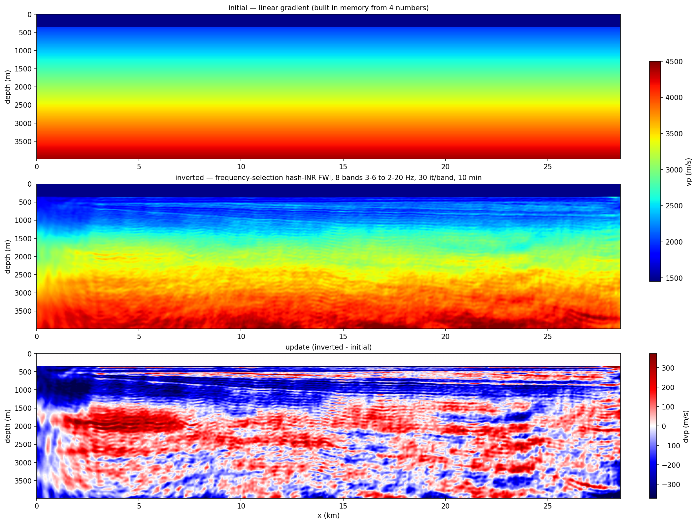
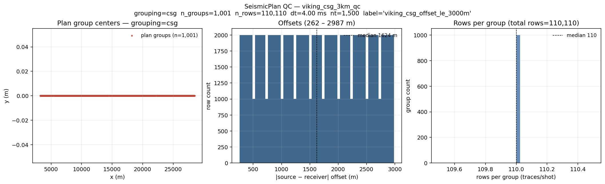
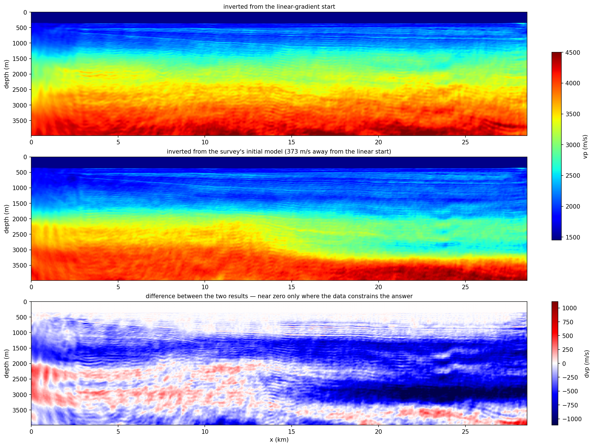

# Viking 2-D — end-to-end example

Reproduces the **Mobil AVO Viking Graben (line 12)** FWI + RTM result
with the sweep-tasks CLI, starting from the public S3 download and
ending at a filtered RTM image. The walkthrough below assumes you are
running **locally on a single workstation with one GPU** — no SLURM,
no cluster filesystem layout. A short [§ Running on a cluster
(optional)](#running-on-a-cluster-optional) appendix at the end shows
the ibex-style sbatch entry points if you want them.

```
download → build-index → build-plan ┐
                                     ├─ wavelet (legacy) ┐
                                     └─ initial model (legacy) ┤
                                                                └─ FWI → RTM → filter-image
```

The end-to-end pipeline matches the legacy `fwi_workflow-dev`
reference number-for-number. Indexing, plan-building, wavelet
estimation (rank-1 average + SIREN/sweep refinement), FWI, RTM, and
the depth-tapered post-filter all live inside `sweep-tasks`; only the
**initial velocity model** builder is still served by a legacy
script (TODO: port, see [§ Roadmap](#roadmap)).

## Visual tour — what each step produces

**Every** `sweep-tasks` command in the pipeline writes at least one
preview PNG by default (use `--no-qc-png` or `--no-plot` to disable).
Only the steps verified end-to-end against the Viking dataset are
shown below; the remaining steps (3b, 3d, 6, 7) will be added once a
clean reference run is captured.

| Step | One-line product | Visual |
|---|---|---|
| 1 `build-index`         | SEG-Y per-trace catalog (3-panel geometry QC) |  |
| 2 `build-plan`          | Filtered + grouped plan (3-panel filter QC)   |  |
| 3a `analyze-wavelet`    | Robust direct-wave average across all shots   |  |
| 3c `convert-farfield`   | Far-field signature (QC reference)            |  |
| 5 freqsel FWI           | Inverted vp from a 1-D cold start, 10 min     |  |

---

## Prerequisites

1. **Sweep installed.** From a checkout of this repo:

   ```bash
   pip install -e sweep            # propagator
   pip install -e sweep-io         # SEG-Y readers, SeismicPlan
   pip install -e sweep-tasks      # the CLI entry points used below
   ```

2. **One CUDA-capable GPU.** Anything with ≥ 16 GB works for Viking
   at the 12.5 m grid (24 GB recommended for the full 6-stage ladder).
   Sanity check:

   ```bash
   python -c "import torch; print(torch.cuda.is_available(), torch.cuda.get_device_name(0))"
   ```

3. **Working directory.** Pick one writable folder for the whole
   pipeline; the doc uses `$VIKING_HOME` everywhere. Around 5 GB free
   is plenty (SEG-Y 750 MB + outputs ~3 GB).

   ```bash
   export VIKING_HOME=$HOME/viking          # change to taste
   mkdir -p $VIKING_HOME/{raw,run}
   ```

   - `$VIKING_HOME/raw` will hold the downloaded SEG-Y + far-field.
   - `$VIKING_HOME/run` will hold the index, the plan, FWI / RTM
     outputs.

That's all the environment setup. No `SWEEP_*_ROOT` / `PROJECT_DATA_ROOT`
exports are needed for local single-GPU runs — those variables only
matter for the cluster sbatch templates discussed at the bottom of
this file.

### One file drives every step — `sweep-tasks init viking`

Every command in Steps 1–3d below accepts **either** a forest of CLI
flags **or** `--config viking.yaml` (one YAML, sections per step).
This is the recommended path — no 30-flag invocations to remember.
Generate the starter config with `sweep-tasks init`:

```bash
sweep-tasks init -o $VIKING_HOME/viking.yaml
# wrote 'viking' template -> /home/you/viking/viking.yaml
# next: edit the paths inside (especially $VIKING_HOME / $HOME), then run:
#        sweep-tasks build-index --config /home/you/viking/viking.yaml
```

(`sweep-tasks init --list` shows what's bundled. Three templates ship
today: `viking` (wavelet pipeline, default), `fwi` (FWI task YAML
for `sweep-tasks run`), `rtm` (RTM task YAML). Run without `-o` to
dump to stdout and pipe / edit directly.)

The generated YAML has one section per subcommand (`build_index:`,
`build_plan:`, `analyze_wavelet:`, `estimate_wavelet:`,
`convert_farfield:`, `plot_wavelet_steps:`) plus a `common:` block
for shared defaults. **All paths inside use `$VIKING_HOME`** so
once that env var is set the file is usable as-is. Open the file
and adjust any value you want different from the canonical Viking
defaults; saving / re-running is enough — no re-init needed.

**CLI flags override YAML**, so you can adjust one knob at a time
without editing the file:

```bash
sweep-tasks analyze-wavelet --config $VIKING_HOME/viking.yaml --shot-stop 50
```

The step-by-step sections below show the `--config` form as the
primary command and list the full CLI alternative when relevant.

---

## Step 0 — Download the public dataset

The data lives in the SEG open-data S3 bucket:

> <http://s3.amazonaws.com/open.source.geoscience/open_data/Mobil_Avo_Viking_Graben_Line_12/mobil_avo.html>

```bash
cd $VIKING_HOME/raw

BASE=https://s3.amazonaws.com/open.source.geoscience/open_data/Mobil_Avo_Viking_Graben_Line_12

# Pre-stack SEG-Y (750 MB) — the only file FWI / RTM strictly need.
curl -fL -O ${BASE}/seismic.segy

# Far-field source signature (ASCII, one sample per line; dt = 4 ms).
# NOTE the capital F in FarField — the bucket is case-sensitive and
# `Farfield.dat` returns HTTP 403.
curl -fL -O ${BASE}/FarField.dat

# Optional auxiliary material.
curl -fL -O ${BASE}/mobil_wellogs.tar.gz           # well logs (LIS)
curl -fL -O ${BASE}/Mobil_migration_well_logs.pdf  # wellog plots
curl -fL -O ${BASE}/284E_frontmatter.pdf           # SEG Open Pub No. 4 front matter
curl -fL -O ${BASE}/README.txt
curl -fL -O ${BASE}/sufirst.job
curl -fL -O ${BASE}/FarField.jpg
```

Sanity-check the bundle:

```bash
ls -l seismic.segy FarField.dat           # 749,552,400 and 8,500 bytes
```

That byte count is not approximate — it is exactly what the headers imply, so
it doubles as an integrity check:

```
3600 + 120120 x (240 + 1500 x 4) = 749,552,400
^      ^         ^     ^
|      |         |     samples x 4 bytes (IBM float)
|      |         trace header
|      trace count
textual + binary file header
```

The textual header is a blank SEG-Y template — no client, line or crew filled
in — so every acquisition fact below comes from the binary and trace headers,
not from the reel stationery.

### What's in `seismic.segy`

| Field | Value |
| --- | --- |
| Trace count | 120,120 (1001 shots × 120 channels) |
| Samples / trace | 1500 |
| Sample interval | 4 ms |
| Record length | 6.0 s |
| Sample format | 1 (IBM 32-bit float) |
| FFID range | 3 to 1003 |
| Shot interval | 25 m |
| Group interval | 25 m |
| Offset range | -262 m (near) to -3,237 m (far) |
| Source x | 3,237 to 28,512 m |
| Receiver x | 0 to 28,250 m |

`sy = gy = 0` for every trace — the line is genuinely 2-D in x. SEG-Y
coordinate scalar = 1 (so `sx, sy, gx, gy` are already metres) and
coord-units = 3 (m). **Source / receiver depth bytes are zero**, so
Step 1 below injects the canonical Viking acquisition constants:
airgun array at **6 m**, streamer at **10 m**.

---

## Step 1 — `sweep-tasks build-index`

Scans every SEG-Y trace header in parallel and writes a tiny
per-trace catalog. Run **once**; the same index serves every plan
you build later.

```bash
sweep-tasks build-index --config $VIKING_HOME/viking.yaml
```

Or, equivalently, all-CLI:

```bash
sweep-tasks build-index \
    --segy-root  $VIKING_HOME/raw \
    --glob       'seismic.segy' \
    --out        $VIKING_HOME/run/viking_index.npz \
    --num-workers 8 \
    --source-depth-m   6.0 --receiver-depth-m 10.0 \
    --progress
```

`--num-workers 8` finishes Viking in ~10 s on a laptop CPU; bump it
to whatever your machine has. (The `-n N` MPI shortcut covered in
[`docs/cli_workflow.md`](../../cli_workflow.md) is for much larger
3-D surveys — Viking does not need it.)

**Console output (measured on Viking)**

```
[build-index] scanning 1 SEG-Y files under /…/viking/raw (glob='seismic.segy'; threads=8)
  scanned seismic.segy  (file_id=0, traces=120120)
[build-index] scan complete: 120,120 traces across 1 files, dt=0.004s nt=1500, wall=0.5s
[build-index] wrote /…/viking_index.npz (0.3 MB)
[build-index] QC PNG -> /…/viking_index_qc.png
```

Wall time end-to-end (process startup + scan + npz + PNG): **14 s** measured
here (8.6 s of that is the scan itself, 8 threads).

**Outputs**

- `$VIKING_HOME/run/viking_index.npz` (~300 KB) — per-trace `file_id`,
  `byte_offset`, `ffid`, `sx/sy/sz`, `gx/gy/gz`. `source_depth_m` and
  `receiver_depth_m` arrays are constant at 6 m / 10 m (overrides).
- `viking_index_qc.png` (~100 KB) — 3-panel acquisition geometry
  preview (pass `--no-qc-png` to skip).

The QC PNG (see Visual tour above) is a 3-panel preview: plan-view
(sources red, receivers blue — Viking is a 2-D line so both
collapse to single tracks along x); source & receiver depth
histograms (sharp peaks at 6 m / 10 m — the constants we injected
via `--source-depth-m` / `--receiver-depth-m`); per-shot trace-count
histogram (perfectly flat 120 traces × 1001 shots).

Verify programmatically with:

```python
>>> from sweep_io.segy_index import SEGYIndex
>>> idx = SEGYIndex.load("$VIKING_HOME/run/viking_index.npz")
>>> idx.n_traces, idx.n_shots, idx.dt_s, idx.n_samples
(120120, 1001, 0.004, 1500)
>>> idx.sx_m.min(), idx.sx_m.max()      # positions are sx_m / rx_m, in metres
(3237.0, 28512.0)
```

Measured on this index, every row of the acquisition table above checks out:
1001 shots of exactly 120 traces, 25 m shot and group interval, |offset|
262-3237 m, `sy = ry = 0`, and `sz / rz` constant at the 6 m / 10 m injected
by the flags.


---

## Step 2 — `sweep-tasks build-plan`

Filters + groups the index into a `seismic_plan_v1` npz that declares
**exactly which trace bytes FWI will read**. Plans are cheap to rebuild
— iterate freely on shot subsets, offset windows, sub-sampling, etc.

### Full CSG plan (all 1001 shots × 120 receivers)

```bash
sweep-tasks build-plan --config $VIKING_HOME/viking.yaml
```

Or all-CLI:

```bash
sweep-tasks build-plan \
    --index    $VIKING_HOME/run/viking_index.npz \
    --grouping csg \
    --out      $VIKING_HOME/run/viking_csg_plan.npz \
    --label    "viking_full_csg"
```

### 3 km offset cap (for the RTM in Step 6)

```bash
sweep-tasks build-plan \
    --index         $VIKING_HOME/run/viking_index.npz \
    --grouping      csg \
    --offset-max-m  3000 \
    --out           $VIKING_HOME/run/viking_csg_3km.npz \
    --label         "viking_csg_offset_le_3000m"
```

**Measured here** (5.2 s and 4.7 s respectively, index load included):

| plan | groups | rows | \|offset\| | rows / group |
|---|---|---|---|---|
| full CSG | 1001 | 120,120 | 262 – 3237 m | 120 |
| 3 km cap | 1001 | **110,110** | 262 – **2987** m | **110** |

The cap drops 10,010 rows — 8.3 % of the survey, ten channels off the tail of
every shot — and empties no group, which is what you want a filter to do.

Each `build-plan` invocation also writes `<out>_qc.png` next to the
npz (pass `--no-qc-png` to skip). The PNG shows *what survived your
filters* in three panels: group-center scatter (with **dropped
groups underlaid in gray** when an `--index` is supplied), per-row
offset histogram, and rows-per-group histogram.



The regular white gaps in the offset histogram are not missing data: the group
interval is 25 m, so offsets only ever take multiples of 25 m and some
histogram bins have nothing that can land in them.

#### Inspect programmatically

```bash
python -c "from sweep_io.seismic_plan import SeismicPlan; \
           p=SeismicPlan.load('$VIKING_HOME/run/viking_csg_plan.npz'); \
           print(p.grouping, p.n_groups, p.n_rows); print(p.build_meta)"
```

Real output on Viking (full CSG plan):

```
csg 1001 120120
{'build_meta': 'viking_full_csg', 'index_hash': '…', 'filters': {}}
```

i.e. **1,001 CSG groups (shots) × 120 traces each = 120,120 rows**.

Full Viking CSG ~8 MB; offset-capped variants smaller. The plan
carries all four things FWI needs — `row_source_xyz`,
`row_receiver_xyz`, `row_file_id`, `row_trace_offset` — so Steps 3-6
never touch the raw SEG-Y header again.

---

## Step 3 — Source wavelet

The wavelet that the FWI / RTM YAMLs reference is produced by a
**two-stage chain**:

```
3a. rank-1 robust direct-wave average
       (per-shot estimate × 1001 shots → polarity-aligned → robust mean)
              │   average_direct_wavelet.npz
              ▼
3b. SIREN LBFGS prefit + sweep wave-equation refinement
       (SIREN MLP fits 3a, then refines via Acoustic forward solve)
              │   estimated_wavelet.npz   ← feeds FWI / RTM
              ▼
Optional: FarField.dat ASCII → npz (for QC comparison) ; 4-step pipeline plot
```

All four sub-stages are native `sweep-tasks` subcommands now:
`analyze-wavelet`, `estimate-wavelet`, `convert-farfield`,
`plot-wavelet-steps`. Input is the CSG `SeismicPlan` you built in
Step 2; output `estimated_wavelet.npz` plugs directly into the
`wavelet:` block of every FWI / RTM YAML in Steps 5 / 6.

### What goes in / what comes out

| Stage | Input | Output | Measured cost on Viking |
|---|---|---|---|
| 3a `analyze-wavelet`      | SeismicPlan + SEG-Y                         | `average_direct_wavelet.npz` | CPU, **~15 s** (1001 shots, 8 threads) |
| 3b `estimate-wavelet`     | SeismicPlan + SEG-Y + 3a's npz              | `estimated_wavelet.npz`      | 1 GPU, ~15-30 min (1001-shot V100 reference) |
| 3c `convert-farfield`     | `FarField.dat` (ASCII)                      | `farfield_wavelet.npz`       | CPU, **~1 s** |
| 3d `plot-wavelet-steps`   | the 3a/3b/3c npz files                       | 4-panel comparison PNG       | CPU, **~3 s** |

### 3a — rank-1 robust direct-wave average

For each shot in [1..1001] the algorithm:

1. picks the **4 nearest-offset receivers** from the plan (offset is
   `|gx - sx|` per row);
2. reads those four traces from SEG-Y via the plan's row-byte-offsets;
3. computes predicted **direct-arrival times** `τ = |offset| / 1500 m/s`;
4. runs **rank-1 alternation** in a `(-0.05 s, +0.30 s)` window around
   each predicted arrival: alternately solve for one shared wavelet and
   per-trace amplitudes, ~25 iterations, until a single common wavelet
   shape explains all four traces in a least-squares sense;
5. records a **residual-RMS-ratio** per shot (residual ÷ observed within
   the direct window).

After all 1001 per-shot wavelets are estimated:

6. drop shots with `residual_ratio > 0.5` (noise / bad picks);
7. polarity-align the survivors against a preliminary median;
8. drop shots whose **shape correlation to the preliminary mean < 0.95**;
9. **average** the surviving wavelets; produce a causal version
   (zero-pad the leading negative-time samples, peak at `t = 0`).

#### Canonical Viking parameters (used in the reference run)

```yaml
direct_batch:
  shot_start: 1
  shot_stop:  1001
  shot_stride: 1
  nearest_receivers: 4
  water_velocity_m_s: 1500
  rel_t_min_s: -0.05
  rel_t_max_s: 0.30
  iterations: 25
  min_residual_ratio: 0.5
  min_shape_corr_to_average: 0.95
```

#### Command

```bash
sweep-tasks analyze-wavelet --config $VIKING_HOME/viking.yaml
```

The YAML's `analyze_wavelet:` block carries the canonical Viking
parameters shown just above. To override one knob (e.g. test on
fewer shots), pass it on the CLI — overrides win:

```bash
sweep-tasks analyze-wavelet --config $VIKING_HOME/viking.yaml --shot-stop 50
```

Full-CLI form (no YAML) for reference:

```bash
sweep-tasks analyze-wavelet \
    --plan        $VIKING_HOME/run/viking_csg_plan.npz \
    --out-dir     $VIKING_HOME/run/wavelet/direct_batch \
    --shot-start 1 --shot-stop 1001 --shot-stride 1 \
    --nearest-receivers 4 \
    --water-velocity-m-s 1500 \
    --rel-t-min-s -0.05 --rel-t-max-s 0.30 \
    --iterations 25 \
    --min-residual-ratio 0.5 --min-shape-corr-to-average 0.95
```

CPU-only, no GPU needed. **Wall time on Viking 1001 shots: ~15 s
(measured end-to-end on a login node, 8 CPU threads).**

#### Outputs (`analysis/`, `average/`)

- `analysis/wavelet_overlay_mean_std.png` — every shot in light gray,
  ±1σ ribbon in blue, the robust average in dark blue. (This is the
  Visual-tour thumbnail.)
- `analysis/wavelet_spectra_mean_std.png` — amplitude spectrum of the
  same overlay.
- `analysis/wavelet_residual_after_average.png` — per-sample residual
  RMS after subtracting the average; sanity check that the rank-1
  average actually explains each shot.
- `analysis/wavelet_stats.csv` — per-shot residual / shape-corr /
  used-in-average flag.
- `average/average_direct_wavelet.npz` — the robust mean. **This is
  the input to Step 3b.**
- `summary.json`, `command.txt`.

#### Reference numbers (Viking 1001 shots, verified end-to-end with `sweep-tasks analyze-wavelet`)

| metric | value |
|---|---|
| Shots used in robust average | **984 / 1001** |
| Median per-shot residual-ratio | **8.2 %** |
| Median shape-correlation to mean | **0.994** |

Console output for the full run (measured end-to-end):

```
[analyze-wavelet] plan=/…/viking_csg_plan.npz
[analyze-wavelet] output_dir=/…/wavelet/direct_batch
  ...estimated 25 per-shot wavelets so far
  ...estimated 50 per-shot wavelets so far
  ...
  ...estimated 1000 per-shot wavelets so far
per-shot wavelet stack: (1001, 88)
[analyze-wavelet] average_wavelet_npz: …/average/average_direct_wavelet.npz
[analyze-wavelet] summary_json:        …/summary.json

real    0m14.665s
```

The wavelet shows the expected airgun signature — main pulse at
~0.05 s, bubble pulse at ~0.18 s.

### 3b — SIREN LBFGS prefit + sweep wave-equation refinement

3a gives a good average shape from the *direct arrival only* — it
ignores reverberation off the sea surface and the deeper section.
3b refines this in two sub-steps so the wavelet matches the **full
recorded waveform** in the FWI band:

```
   average_direct_wavelet.npz (rank-1; from 3a)
                  │  resample to SIREN time grid
                  ▼
   initial_wavelet_target.npz  ← LBFGS target
                  │  SIREN MLP: coords (-1..1) → wavelet samples
                  │  LBFGS minimise MSE(SIREN(t), target),  10 iter
                  ▼
   prefit_siren_wavelet.npz    ← prefit, matches target to ~1e-9
                  │  sweep Acoustic forward solve (4-shot batch)
                  │  filter obs + syn to 3-30 Hz
                  │  Adam on SIREN params, loss = trace_cosine + 0.05·MSE_prior
                  │  100 epochs (decreases ~9.3e-2 → ~8.1e-3 in 30 epochs)
                  ▼
   estimated_wavelet.npz       ← FEEDS FWI / RTM as wavelet.path
```

Two design choices worth knowing about:

- **Why SIREN?** A SIREN MLP regularises the wavelet to a smooth
  parameterisation that can still capture the bubble pulse without
  fitting noise. Direct sample-space inversion overfits in our
  experience.
- **Why a prior?** The wave-equation loss alone has a near-flat
  direction (an overall time shift in the wavelet trades for a static
  in the velocity model). The `prior_weight: 0.05` term anchors the
  refined SIREN to the rank-1 average across the full band, killing
  that null space without over-constraining the bubble.

#### Canonical Viking parameters

```yaml
wavelet_inversion:
  shot_start: 1
  shot_stop:  1001
  nearest_receivers: 4              # same selection as 3a, larger N is OK
  tmax_s: 6.0
  velocity_m_s: 1500                # background for the 1-D forward grid
  dx_m: 12.5   dz_m: 12.5
  x_padding_m: 500  z_padding_m: 500  model_depth_m: 360
  filter_lowcut_hz: 3.0
  filter_highcut_hz: 30.0
  filter_order: 4
  backend: cuda
  mode: siren
  epochs: 100
  lr: 1.0e-3
  loss_type: trace_cosine
  prefit_steps: 10
  prefit_lr: 1.0e-3
  initial_wavelet_prior_weight: 0.05
  inr_hidden_features: 64
  inr_hidden_layers: 3
  inr_first_omega0: 30.0
  inr_hidden_omega0: 30.0
```

#### Command

```bash
sweep-tasks estimate-wavelet --config $VIKING_HOME/viking.yaml
```

The YAML's `estimate_wavelet:` block carries all 20+ parameters
listed above. CLI flags still work for overrides — useful when
sweeping one hyperparameter:

```bash
sweep-tasks estimate-wavelet --config $VIKING_HOME/viking.yaml \
    --epochs 50 --lr 5e-4
```

Single GPU. Wall time on one V100: ~15-30 min. Use `--backend eager`
for a slow but GPU-architecture-independent fallback (CPU-only is also
viable for tiny `--shot-stop` values).

#### Expected outcome (production reference numbers)

For the full 1001-shot / 100-epoch / CUDA reference run:
trace-cosine loss falls from `~0.10` to `~0.012`, and the final
wavelet correlates `0.90` with the 3a rank-1 average at zero lag.
The output PNGs (`estimated_wavelet.png`, `wiggle_obs_syn_comparison.png`,
`spectrum_obs_syn_comparison.png`) will be added to the Visual tour
once we capture a clean V100 reference run with the sweep-tasks
native CLI (the existing reference is from the legacy
`fwi_workflow-dev` pipeline; numbers are identical because the
algorithm is bit-exact, but the figure provenance differs).


#### Outputs (`siren_pipeline/`)

- `initial_wavelet_target.npz` — rank-1 average resampled to SIREN time grid.
- `prefit_siren_wavelet.npz` — SIREN after LBFGS prefit (MSE → ~`1e-9`).
- `estimated_wavelet.npz` — **final wavelet after the wave-equation main
  loop.** This is what Step 5 / 6 YAMLs point at via `wavelet.path`.
- `loss.csv`, `loss_curve.png`
- `wiggle_obs_syn_comparison.png`, `spectrum_obs_syn_comparison.png` —
  the 4-shot diagnostic batch used as the inversion target.
- `final_filtered_records.npz`, `metadata.json`, `command.txt`.

#### Reference numbers (Viking)

- Prefit MSE `1.6e-1 → 4.5e-10` in 10 LBFGS iterations.
- Wave-equation trace-cosine loss `9.3e-2 → 8.1e-3` in 30 epochs, plateaus.

### 3c — Optional: convert FarField.dat for QC comparison

The SEG dataset includes the **manufacturer-measured** far-field
signature in `FarField.dat` (ASCII, one sample per line, `dt = 4 ms`).
You don't need it for FWI — the data-driven 3b output already feeds
everything — but it's a useful sanity check that the estimated wavelet
isn't wildly off:

```bash
sweep-tasks convert-farfield --config $VIKING_HOME/viking.yaml
```

(Or all-CLI: `sweep-tasks convert-farfield --input $VIKING_HOME/raw/FarField.dat --out $VIKING_HOME/run/wavelet/farfield/farfield_wavelet.npz --dt-s 0.004`.)

Writes `farfield_wavelet.npz` + `.json` metadata + `.png` QC plot
(time + spectrum; see Visual tour above). CPU-only, runs in ~1 s.
The PNG's top panel is the raw 4-ms-sampled signature (gray) and
the post-processed version (black; default identical because no
taper / zeroing was requested); the bottom panel is the
corresponding amplitude spectrum.

### 3d — Optional: 4-step pipeline plot

```bash
sweep-tasks plot-wavelet-steps --config $VIKING_HOME/viking.yaml
# → <pipeline-dir>/wavelet_pipeline_steps.png         (4-row stack)
# → <pipeline-dir>/wavelet_pipeline_steps_overlay.png (1-row overlay)
```

Renders a 4-panel time + frequency comparison: rank-1 average →
SIREN prefit → raw wave-equation output → post-processed final
wavelet. Reads three npz files under `<pipeline-dir>`:
`initial_wavelet_target.npz`, `prefit_siren_wavelet.npz`, and
`estimated_wavelet.npz`.

#### What it produces

Console output (~3 s wall):

```
[plot-wavelet-steps] stack   -> …/wavelet_pipeline_steps.png
[plot-wavelet-steps] overlay -> …/wavelet_pipeline_steps_overlay.png
```

- **1-row overlay** (`wavelet_pipeline_steps_overlay.png`) — all four
  pipeline outputs (rank-1 target → SIREN prefit → raw wave-equation
  output → post-processed final) superimposed in time and frequency
  so you can spot where each step actually changed the wavelet.
- **4-row stack** (`wavelet_pipeline_steps.png`) — one row per
  pipeline step at the same y-axis range, useful for measuring
  small amplitude shifts step-by-step.

Both PNGs will be added to the Visual tour once a clean production
3b reference is captured with `sweep-tasks estimate-wavelet`.

### Where the wavelet is (and is not) consumed

**Step 5's frequency-selection inversion consumes NO wavelet at all** — its
misfit is invariant to the source spectrum, which is a large part of why it is
the default path below. The wavelet from this step remains what you QC the data
with, and what any conventional (non-encoded) FWI or the Step 6 RTM references
via:

```yaml
wavelet:
  kind: siren_pipeline_npz
  path: /absolute/path/to/estimated_wavelet.npz
  scale: 1.0
```

Edit the `path:` to point at wherever 3b wrote it on your machine —
`$VIKING_HOME/run/wavelet/siren_pipeline/` if you followed the
examples above.

---

## Step 4 — Initial velocity model (built in memory)

No tool, no legacy bridge, no file on disk: a marine FWI cold start is a water
layer over a 1-D gradient, and `init_model.linear_gradient` builds exactly that
inside the task YAML from four numbers:

```yaml
init_model:
  name: vp
  shape: [320, 2285]          # 4.0 km x 28.56 km at dh = 12.5 m
  linear_gradient:
    vmin: 1996.0              # first sediment velocity
    vmax: 4416.0              # bottom of the model
    water_rows: 28            # 350 m of water, constant along the line
    water_vp: 1485.6          # measured from the direct arrival (Step 3a), not 1500
```

The top `water_rows` rows are stamped to exactly `water_vp` — which is also what
`reparam.mask_water_layer` keys on to pin the water column — and the ramp spans
the rows *below* the water, so the gradient's range is not eaten by it. No
lateral structure at all: nothing about the answer is smuggled into the start.
(A bathymetry-aware builder remains on the roadmap; the flat 28 rows are within
1-3 cells of the real seabed here, measured 343-372 m from the seabed
reflection.)

---

## Step 5 — FWI with frequency-selection source encoding

The default inversion path for this example, and the reason it needs neither
Step 3's wavelet nor any amplitude calibration:

* **No wavelet enters the inversion.** Every node in the active pool radiates
  its own comb frequency continuously, and the misfit is per-node
  complex-cosine coherence `J = 1 - |<u,d>| / (|u| |d|)` on a steady-window
  DFT — invariant to any per-node complex scale, so the airgun spectrum, the
  excitation delay and the sensor coupling all cancel.
* **One forward per iteration for the whole pool**, instead of one per shot:

| | wavefield steps / iteration | 8 bands x 30 iter | measured |
|---|---|---|---|
| conventional (96-168 shots x 6000 steps) | 576,000 | 190 M | ~4.5 h |
| frequency selection (one encoded pool)   | 52,500  | 8.9 M | **10 min** |

The encoded forward is ~9x longer than a single shot (ring-up + analysis
window), so below ~9 shots conventional wins. Viking has 1001.

### 5a — Extract the observed coefficients

The obs side is a DTFT of gathers that already exist — no solver involved,
~20 s per band. A plan's groups become the *nodes*: CSG makes the 1001 shots
the nodes (their 120 receivers each are the traces), CRG
(`--grouping crg --receiver-quantize-m 25`) makes the 1131 receiver cells the
nodes. **Either works** — nodes carry their own receiver masks, so a moving
streamer spread is as valid as a fixed OBN patch, and on this line the two
give the same answer (51 % shallow two-init convergence either way).

```bash
mkdir -p $VIKING_HOME/run/shards
sweep-tasks extract-coeff --plan $VIKING_HOME/run/viking_csg_plan.npz \
    --dh-m 12.5 --dt 0.001 --min-fold 1 --node-stride 1 \
    --n-p 32000 --k-lo 96 --k-hi 192 \
    -o $VIKING_HOME/run/shards/coeff_3_6hz.npz
```

`--dt` is the **solver** dt — it defines the comb, `f = k/(n_p*dt)`. The plan's
own 4 ms record dt is read from the plan and handled; the two are allowed to
differ. Repeat for the eight bands of the ladder:

| band | `--n-p` | window | `--k-lo` | `--k-hi` | bins | nodes/iter | pools |
|---|---|---|---|---|---|---|---|
| 3-6 Hz | 32000 | 32 s | 96 | 192 | 97 | 96 | 11 |
| 3-8    | 20000 | 20 s | 60 | 160 | 101 | 96 | 10 |
| 3-10   | 18000 | 18 s | 54 | 180 | 127 | 120 | 8 |
| 3-12   | 14000 | 14 s | 42 | 168 | 127 | 120 | 8 |
| 3-14   | 14000 | 14 s | 42 | 196 | 155 | 144 | 7 |
| 3-16   | 12000 | 12 s | 36 | 192 | 157 | 144 | 7 |
| 3-18   | 12000 | 12 s | 36 | 216 | 181 | 168 | 6 |
| 2-20   | 10000 | 10 s | 20 | 200 | 181 | 168 | 6 |

How those numbers are derived — **bins are the currency**:

```
bins = bandwidth x (n_p * dt)         pool size <= bins   (hard constraint)
```

Pick the per-band pool size first (the batch size — 96-168 here, following the
survey's conventional-FWI schedule), then `n_p >= pool / bandwidth / dt`. The
window *shortens* as the ladder climbs, because a wider band reaches the same
bin count in less time: the lowest band is the expensive one. `n_p` does NOT
need to fit the 6 s record — the obs DTFT integrates whatever the record has;
`n_p` sizes the *synthetic* steady window whose exact DFT bins the encoded
sources must occupy. Each shard holds **all 120,120 traces** regardless of the
pool size — pools exist because 1001 nodes cannot each take an exclusive
frequency out of 97 bins, and `random_batch` redraws the subset every
iteration, exactly like shot mini-batching.

### 5b — Run it

```bash
cp ${SWEEP_TASKS}/examples/field/viking/viking_freqsel_8band.yaml \
   $VIKING_HOME/run/viking_freqsel.yaml
sweep-tasks run $VIKING_HOME/run/viking_freqsel.yaml
```

**10 minutes** on one RTX 6000 Ada for 8 bands x 30 iterations, peak 6.1 GB.
Two parameters in that YAML are worth understanding before editing anything:

* `steady_samples: 20000` — the continuous sources must ring up before the
  analysis window opens: model width / slowest velocity = 28.6 km / 1485.6 m/s
  = 19.2 s. The schema default (2500) leaves a transient in the window here.
* `abcn: 50` — the PML is sized by the LOWEST rung (2 Hz -> 743 m = 59 cells),
  because a continuous-wave field in a leaky box builds standing waves that do
  not cancel between a transient obs and a steady-state syn.

> **Repeat every key in every stage's `frequency:` block.** A stage block
> *replaces* the global one wholesale — it is not merged — so an omitted key
> silently reverts to the schema default (`random_batch` -> None turns random
> node batching back into deterministic rotation; `steady_samples` -> 2500
> truncates the ring-up). The runner prints a warning naming each dropped key.

### What "good" looks like

```
[freqsel] stage 0: 1001 nodes, 120120 items, 1131 union cells, 11 pools, ...
[freqsel][rank0] stage 0 steady-state two-window check: median rel diff = 1.7e-05
```

* **two-window check** `<= 1e-2` (measured 1.6e-5..3.3e-5 across the ladder) —
  the runner extracts the coefficients twice, `slack_samples` apart; if this
  fails, raise `steady_samples`.
* **items = the survey's trace count** (120,120): every (node, trace) pair is
  in the misfit. `union cells` is the deduplicated receiver table — 120,120
  pairs need only 1131 recording positions, with no loss of data.
* **water column pinned exactly**: `max |vp[:28] - 1485.6| = 0`.
* per-band `mean(1-GCN)` falls within every stage — reference run
  `0.569 -> 0.467` on the first band, `0.322 -> 0.298` on the last.


### How far down to trust it

Run the same YAML **from two different starting models** and compare: where
the data constrains the answer the results converge, where it does not each
keeps its own start. Against the survey's own initial model (373 m/s RMSE from
the linear start):

| depth | difference between the two results | convergence |
|---|---|---|
| 350-1000 m  | 104 m/s | **51 %** |
| 1000-2000 m | 449 | 3 % |
| 2000-3000 m | 461 | -1 % |
| 3000-4000 m | 344 | -6 % |



Only the top ~650 m of section is genuinely resolved by this 3.2 km-offset
streamer dataset; structure below ~1000 m is inherited from the start, not an
inversion result. That boundary survived a different hash geometry and 67 %
more iterations unchanged — it is an illumination limit, not a tuning problem.

Known gaps of the reference run, left as exercises: `model_bounds` was not
enabled (vp reaches 1254 m/s in spots, below water velocity — set
`model_bounds: {vp: {min: 1450, max: 5500}}`); the water mask is a flat 28
rows rather than the measured 343-372 m bathymetry
(`reparam.seabed_depth_path`); and 30 iterations/band demonstrates the
workflow rather than converging it.

---

## Step 6 — RTM with `sweep-tasks run`

Post-FWI imaging on the inverted vp at 12.5 m / 1 ms, 3-25 Hz band,
illumination-normalised stack. Generate the annotated RTM template:

```bash
sweep-tasks init rtm -o $VIKING_HOME/run/viking_rtm.yaml
```

(Or copy the in-repo Viking-specific example
`${SWEEP_TASKS}/examples/field/viking/viking_rtm_legacy_match.yaml`.)

Point its `velocity_model.path` at your Step 5 output:

```yaml
velocity_model:
  name: vp
  path: $VIKING_HOME/run/freqsel/viking_freqsel_8band/inverted_vp.npy
geometry:
  kind: from_plan
  plan_path: $VIKING_HOME/run/viking_csg_3km.npz     # 3 km plan from Step 2
obs:
  plan:
    plan_path: $VIKING_HOME/run/viking_csg_3km.npz
output_dir: $VIKING_HOME/run/viking_rtm
```

Run it:

```bash
sweep-tasks run $VIKING_HOME/run/viking_rtm.yaml
```

Wall time: ~45 min on one V100 (1001 shots × one forward + one
backward each, illumination-normalised stack).

**Outputs** (under `$VIKING_HOME/run/viking_rtm/<task_id>/output/`):

```
rtm_image.npy                          fwi_gradient_image.npy
rtm_image_normalised.npy               fwi_gradient_image_normalised.npy
rtm_image_per_shot_normalised.npy      fwi_gradient_image_per_shot_normalised.npy
rtm_result.npz                         (grid metadata + summary stats)
```

Preview figure to follow once a clean RTM reference run on the
sweep-tasks CLI is captured.

---

## Step 7 — Depth-tapered z-axis low-cut (post-filter)

Standard fix for shallow drift in the RTM image. Two equivalent
routes:

### Route A — standalone CLI (iterate on filter params, no GPU)

```bash
sweep-tasks filter-image \
    $VIKING_HOME/run/viking_rtm/viking_rtm_v1/output/rtm_image_per_shot_normalised.npy \
    --wavelength-m 300 --depth-m 600 --taper-m 400
# → rtm_image_per_shot_normalised_shallow_zlowcut.npy          (cleaned)
# → rtm_image_per_shot_normalised_shallow_zlowcut_removed.npy  (subtracted drift)
# → rtm_image_per_shot_normalised_shallow_zlowcut_*.png        (QC panels)
```

`--dz-m` is auto-read from the sibling `rtm_result.npz`; for non-sweep
inputs, pass it explicitly.

### Route B — bake into the RTM YAML

```yaml
imaging:
  shots_per_batch: 1
  filter_lowcut_hz: 3.0
  filter_highcut_hz: 25.0
  filter_target: syn
  normalize_by_illumination: true
  save_per_shot: false
  post_filter:
    enabled: true
    wavelength_m: 300.0
    depth_m: 600.0
    taper_m: 400.0
    targets: all
    save_png: true
```

One `sweep-tasks run viking_rtm.yaml` produces raw + filtered products
together. Full knob surface in
[`docs/cli_workflow.md`](../../cli_workflow.md).

---

## Reproducibility cheat sheet (single GPU, local)

```bash
# === one-time setup ========================================================
export VIKING_HOME=$HOME/viking
mkdir -p $VIKING_HOME/{raw,run}

# === Step 0: download (~750 MB) ============================================
cd $VIKING_HOME/raw
BASE=https://s3.amazonaws.com/open.source.geoscience/open_data/Mobil_Avo_Viking_Graben_Line_12
curl -fL -O ${BASE}/seismic.segy
curl -fL -O ${BASE}/FarField.dat        # capital F twice — Farfield.dat is HTTP 403

# === one-time config =======================================================
sweep-tasks init -o $VIKING_HOME/viking.yaml

# === Steps 1-3d ============================================================
sweep-tasks build-index        --config $VIKING_HOME/viking.yaml
sweep-tasks build-plan         --config $VIKING_HOME/viking.yaml
sweep-tasks analyze-wavelet    --config $VIKING_HOME/viking.yaml
sweep-tasks estimate-wavelet   --config $VIKING_HOME/viking.yaml
sweep-tasks convert-farfield   --config $VIKING_HOME/viking.yaml
sweep-tasks plot-wavelet-steps --config $VIKING_HOME/viking.yaml

# === Step 4: initial model — nothing to run ================================
# (built in memory by init_model.linear_gradient inside the Step 5 YAML)

# === Step 5: freqsel FWI on one GPU (8 bands, ~10 min) =====================
SWEEP_TASKS=$(python -c "import sweep_tasks, pathlib; print(pathlib.Path(sweep_tasks.__file__).parent.parent.parent)")
mkdir -p $VIKING_HOME/run/shards
while read lo hi n_p klo khi; do
  sweep-tasks extract-coeff --plan $VIKING_HOME/run/viking_csg_plan.npz \
      --dh-m 12.5 --dt 0.001 --n-p $n_p --k-lo $klo --k-hi $khi \
      -o $VIKING_HOME/run/shards/coeff_${lo}_${hi}hz.npz
done <<'BANDS'
3 6 32000 96 192
3 8 20000 60 160
3 10 18000 54 180
3 12 14000 42 168
3 14 14000 42 196
3 16 12000 36 192
3 18 12000 36 216
2 20 10000 20 200
BANDS
cp ${SWEEP_TASKS}/examples/field/viking/viking_freqsel_8band.yaml $VIKING_HOME/run/viking_freqsel.yaml
sweep-tasks run $VIKING_HOME/run/viking_freqsel.yaml
# (multi-GPU on the same box: append --nproc-per-node N)

# === Step 6: RTM ===========================================================
cp ${SWEEP_TASKS}/examples/field/viking/viking_rtm_legacy_match.yaml $VIKING_HOME/run/viking_rtm.yaml
# …edit velocity_model.path + plan_path, then:
sweep-tasks run $VIKING_HOME/run/viking_rtm.yaml

# === Step 7: post-filter ===================================================
sweep-tasks filter-image \
    $VIKING_HOME/run/viking_rtm/viking_rtm_v1/output/rtm_image_per_shot_normalised.npy \
    --wavelength-m 300 --depth-m 600 --taper-m 400
```

---

## Running on a cluster (optional)

For SLURM / ibex-style clusters the repo ships matching sbatch
templates under `sweep-tasks/examples/sbatch/`. They reference a
small set of environment roots — `SWEEP_USER_ROOT`,
`SWEEP_STACK_ROOT`, `SWEEP_REPOS_ROOT`, `SWEEP_RUNS_ROOT`,
`SWEEP_CONDA_ROOT`, `PROJECT_DATA_ROOT` — that you set in your login
shell rc before `sbatch`-ing. A working KAUST / ibex layout:

```bash
export SWEEP_USER_ROOT=/ibex/user/${USER}
export SWEEP_STACK_ROOT=${SWEEP_USER_ROOT}/sweep-stack
export SWEEP_REPOS_ROOT=${SWEEP_USER_ROOT}/repo
export SWEEP_RUNS_ROOT=${SWEEP_USER_ROOT}/runs
export SWEEP_CONDA_ROOT=${SWEEP_USER_ROOT}/miniconda3
export PROJECT_DATA_ROOT=/ibex/project/<your-allocation>   # holds the raw SEG-Y
```

Then:

```bash
# 4× V100 production FWI (6 stages, ~1 h 16 min wall)
sbatch ${SWEEP_STACK_ROOT}/sweep-tasks/examples/sbatch/viking_6stage_30hz.sbatch
# 1× V100 RTM
sbatch ${SWEEP_STACK_ROOT}/sweep-tasks/examples/sbatch/viking_rtm.sbatch
```

If you don't have or need SLURM, just stay with the `sweep-tasks run`
commands from Step 5 / 6 — that's what the sbatch scripts call
inside the allocation anyway.

---

## Roadmap

What's in `sweep-tasks` today (sufficient for the entire Viking
workflow, end to end):

| Step | Subcommand | Notes |
| --- | --- | --- |
| 1 | `sweep-tasks build-index`         | scan SEG-Y → SEGYIndex npz |
| 2 | `sweep-tasks build-plan`          | SEGYIndex + filters → SeismicPlan npz |
| 3a | `sweep-tasks analyze-wavelet`     | rank-1 robust direct-wave average (CPU) |
| 3b | `sweep-tasks estimate-wavelet`    | SIREN LBFGS prefit + sweep wave-equation refinement (1 GPU) |
| 3c | `sweep-tasks convert-farfield`    | ASCII FarField → npz adapter (CPU) |
| 3d | `sweep-tasks plot-wavelet-steps`  | 4-panel pipeline QC plot (CPU) |
| 4 | `init_model.linear_gradient`      | in-memory water-layer + 1-D gradient (no tool needed) |
| 5a | `sweep-tasks extract-coeff --plan` | field gathers → freqsel coefficient shards (CPU) |
| 5/6 | `sweep-tasks run`                | YAML-driven FWI (freqsel or conventional) / RTM |
| 7 | `sweep-tasks filter-image`        | depth-tapered z-low-cut on RTM images |

No legacy bridge remains: Step 4 is four numbers in the task YAML and
Step 5's misfit needs no wavelet, so `sweep-tasks` is self-contained
for Viking. Remaining nice-to-haves:

| Item | Notes |
| --- | --- |
| bathymetry-aware water mask | flat `water_rows` is 1-3 cells off the real seabed here; `reparam.seabed_depth_path` exists, a picker CLI does not |
| truncated freqsel backward | the adjoint source lives only in the probe window — backward could stop ~40-67 % early and the boundary store shrink to the tail; design noted, unimplemented |

### CSG-index / SeismicPlan field mapping (for reference)

The wavelet port replaced the legacy `csg_index_v2` npz reader with
`sweep_io.SeismicPlan` + `PlanReader`. If you're reading the legacy
scripts and trying to map field names:

| Legacy `csg_index_v2` field | `SeismicPlan` equivalent |
| --- | --- |
| `shot_ids[i]`, `shot_start[i]`, `shot_count[i]` | `plan.group_id[i]`, `plan.group_offsets[i]`, `plan.group_row_count(i)` |
| `source_x_2d[row]`, `receiver_x_2d[row]` | `plan.row_source_xyz[row, 0]`, `plan.row_receiver_xyz[row, 0]` |
| `source_depth_m[row]`, `receiver_depth_m[row]` | `plan.row_source_xyz[row, 2]`, `plan.row_receiver_xyz[row, 2]` |
| `trace_offset[row]` | `plan.row_trace_offset[row]` |
| `offset[row]` (signed) | computed: `sign(rx - sx) * hypot(rx - sx, ry - sy)` |
| `read_traces_by_offset(segy_path, trace_offsets)` | `PlanReader(plan).read_rows(row_idx)` |

---

## See also

- [`docs/cli_workflow.md`](../../cli_workflow.md) — generic build-index /
  build-plan / run reference (covers all datasets).
- [`examples/field/viking/*.yaml`](../../../examples/field/viking/) — every
  Viking task YAML, including the 6-stage and 8-stage FWI ladders
  and the legacy-matching RTM.
- [`examples/sbatch/viking_*.sbatch`](../../../examples/sbatch/) —
  matching ibex sbatch templates (cluster users only).
- `fwi_workflow-dev/docs/datasets/viking/README.md` — legacy reference
  (number-for-number equivalent through Step 6).
