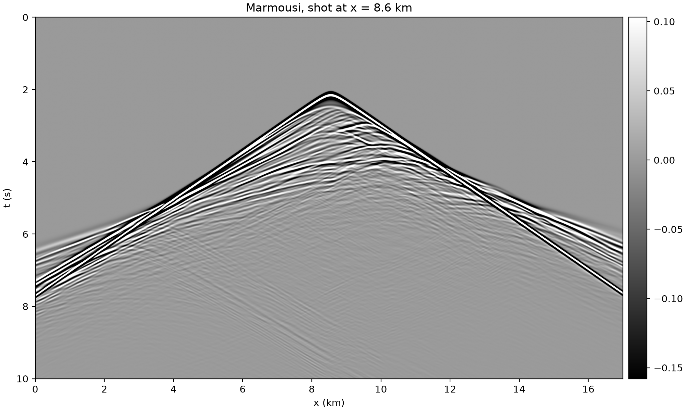
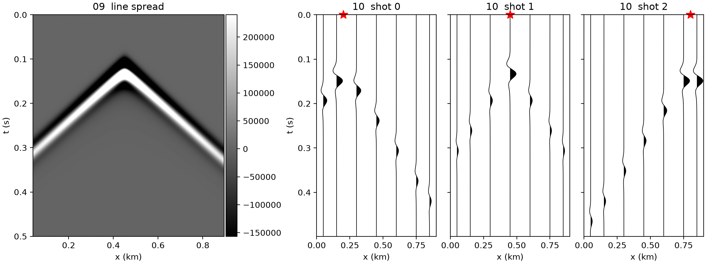

# Forward modelling

`task_type: forward` propagates a wavelet through a model and records it at the
receivers. Three examples, smallest last: 01 is the Marmousi record the
inversion pages invert, 09 is the smallest task there is, and 10 places sources
and receivers by hand.

## 01 — a Marmousi shot record

```bash
sweep-tasks run examples/synthetic/01_forward_marmousi.yaml
```

Propagates an 8 Hz Ricker through `vp_true` with 114 shots at 150 m and a
1361-channel fixed spread, recording 10 s at dt = 1 ms. It produces
`output/record.npy` with shape `(114, 10000, 1361, 1)` plus `sources.npy` and
`receivers.npy`.

**Reference (RTX 6000 Ada, seed 0): 34 s.**



The first arrival starts at 2 s rather than 0: the wavelet carries 2 s of
lead-in (`wavelet.delay: 2.0`), which [03](fwi-multiscale.md) needs so that
low-passing the Ricker to 0.5–2 Hz does not clip its left lobe. 01–03 share
one wavelet so their results are directly comparable.

Two properties of this acquisition drive the choices in the FWI examples:

* **obs dominant frequency is 7.10 Hz**, not the source's 8 Hz — propagation
  and geometric spreading shift the peak down. Half a period is 70 ms.
* **the latest first break lands at 8.59 s** of the 10 s record. A 7 s record
  (the obvious first guess) cut the far offsets off *right after* their first
  arrival: 31.7 % of the edge shots' traces kept under 1 s of coda. At 10 s
  that figure is 0 %.

## 09 — the smallest task there is

```bash
sweep-tasks run examples/synthetic/09_forward_constant_box.yaml
```

One shot through a constant-velocity box. Its point is the YAML, not the
result: it annotates **every field** of a task spec — what it does, what the
alternatives are, what the default means — and the other examples assume that
vocabulary. It needs no dataset and no GPU (it runs on `eager`), and produces
`output/record.npy` with shape `(1, 500, 172, 1)`.

A constant model has no reflections, so the record is the direct arrival and
nothing else. That is what makes it a good first test: anything other than one
clean hyperbola means the setup, not the geology, is wrong.

## 10 — hand-placed sources and receivers

```bash
sweep-tasks run examples/synthetic/10_forward_explicit_geometry.yaml
```

The same box as 09, with `geometry.kind: explicit` — literal coordinate lists
instead of a stride rule. Three shots, seven receivers, record shape
`(3, 500, 7, 1)`. Only the `geometry:` block differs from 09.



The four geometry kinds, and when each earns its place:

| `geometry.kind` | what it is | use it for |
|---|---|---|
| `line` | stride rule, 2-D only | regular 2-D surveys — the default |
| `grid` | stride rule on x **and** y, 3-D only ([13](freqsel-3d.md)) | regular 3-D patches |
| `explicit` | literal lists, as here | irregular or small layouts — a gap in the spread, one odd node |
| `from_file` | the same arrays as `.npy` | layouts a script generated |

`from_segy_headers`, `from_segy_index` and `from_plan` read real acquisition
geometry out of field data; the [Viking](../datasets/viking/README.md) example
uses those.
