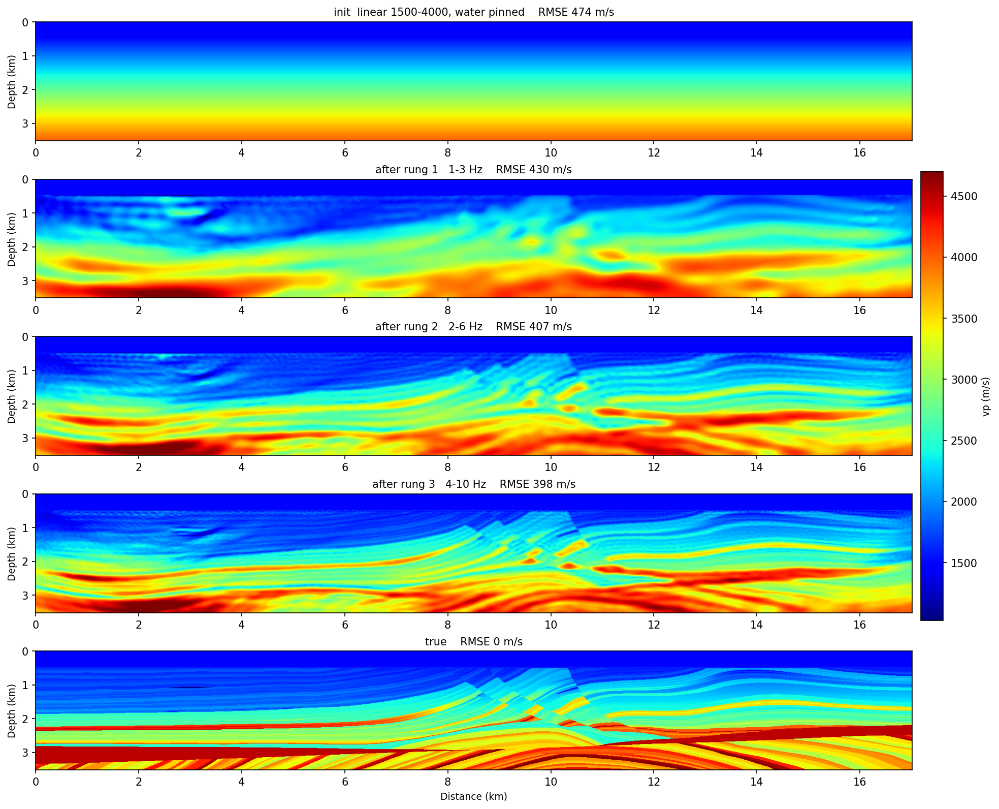

# Frequency-selection FWI, 2-D

```bash
RUNS=examples/synthetic/sweep_runs
sweep-tasks run examples/synthetic/11_forward_freqsel_nodes.yaml
sweep-tasks extract-coeff $RUNS/forward_freqsel_nodes --n-p 50000 --k-lo 50 --k-hi 150 -o $RUNS/coeff_1_3hz.npz
sweep-tasks extract-coeff $RUNS/forward_freqsel_nodes --n-p 25000 --k-lo 50 --k-hi 150 -o $RUNS/coeff_2_6hz.npz
sweep-tasks extract-coeff $RUNS/forward_freqsel_nodes --n-p 17000 --k-lo 68 --k-hi 170 -o $RUNS/coeff_4_10hz.npz
sweep-tasks run examples/synthetic/12_fwi_marmousi_freqsel.yaml
```

Three steps rather than one, because this method inverts **pre-extracted
frequency coefficients**, not gathers. Every node of the array radiates its own
comb frequency continuously; the DFT of a steady-state window separates them
exactly, so the whole array rides one forward per iteration with deterministic
zero crosstalk (Tromp & Bachmann, 2019).

The misfit is a per-node complex-cosine coherence, invariant to any per-node
complex scale — which is why there is **no `wavelet:` in the inversion YAML at
all**. Source spectrum, excitation delay and sensor coupling are all complex
scales, and they cancel.

## Step 1 — record the node gathers (11)

11 uses OBN reciprocity: the 100 **nodes** are the sources and the shot
positions are the receivers, which is the layout the encoding needs. Its record
is 2.7 GB. In a field project this file does not exist — real node gathers
replace it, and everything downstream is identical.

**Reference (RTX 6000 Ada, seed 0): forward 76 s.**

## Step 2 — extract one shard per rung (`extract-coeff`)

Extraction is a DTFT of a record that already exists, so the frequencies a
project can invert are set by the **source spectrum**, not by how many forwards
you run. One forward feeds the whole ladder — the Ricker in 11 is `fm: 5.0`,
chosen to cover 1–10 Hz rather than to peak on the first rung. Each rung gets
its own shard because the inversion refuses one whose bins disagree with the
stage reading it: `--n-p` must equal that stage's `probe_samples`.

**Reference: 45 s / 15 s / 15 s** for the three extractions.

## Step 3 — invert (12)

**Reference (RTX 6000 Ada, seed 0), 240 iterations, 11.9 min:**

| after | RMSE vs true |
|---|---|
| init (same 1-D ramp as [03](fwi-multiscale.md)) | 473.7 |
| rung 1 — 1–3 Hz | 429.6 |
| rung 2 — 2–6 Hz | 406.5 |
| rung 3 — 4–10 Hz | **397.9** |

`r` = 0.575; low-wavenumber RMSE 321.6 → 243.4.



## Against conventional FWI, at equal cost

|  | solver steps | wall | RMSE | `r` |
|---|---|---|---|---|
| [03](fwi-multiscale.md), conventional | 16.0 M | 11.5 min | **317.3** | **0.752** |
| 12, freqsel | 10.5 M | 11.9 min | 397.9 | 0.575 |

Conventional FWI wins here and this page does not pretend otherwise. On
Marmousi the wavelet is known exactly, so the wavelet-free property is worth
nothing. On a field OBN survey — unknown source signature, unknown per-node
coupling — it is the difference between having a workflow and not.

## Sizing a comb: bins are the currency, not shots

Two relations govern every number in the `frequency:` blocks:

```
bins  =  bandwidth × window length          (window = probe_samples × dt)
pool size  ≤  bins                          (hard constraint)
```

Extra sources ride the **same** forward for free, so the way to fire more nodes
at once is to lengthen the analysis window, which buys bins linearly. Note the
consequence: the window *shortens* as the ladder climbs, because a wider band
reaches the same bin count in less time. The expensive rung is the lowest one.

Each iteration runs `steady_samples + slack_samples + probe_samples` steps.
`steady_samples` is dead time while the continuous sources ring up; the runner
prints a two-window steady-state check at every stage entry, and the target is
≤ 1e-2.

Two things that cost real runs to learn:

* **Start the ladder low enough.** [03](fwi-multiscale.md)'s criterion applies
  unchanged: this 1-D start is −160 ms off at 2 km, so the first rung must sit
  below 3.1 Hz. A 2–4 Hz first rung rides that line and reproducibly fails — it
  drove the model *away* from the truth (RMSE 473.7 → 520.8) while the misfit
  fell 3.2×.
* **Size the PML by the longest wavelength, not by habit.** At 1 Hz the
  wavelength is ~1500 m and the default `abcn: 20` is only 250 m — λ/6. A
  continuous-wave field in a leaky box builds standing waves, and unlike a
  transient that does *not* cancel between a transient obs and a steady-state
  syn. `abcn: 40` (in both 11 and 12) puts the 1–3 Hz rung's steady-state check
  at 5.9e-3.
