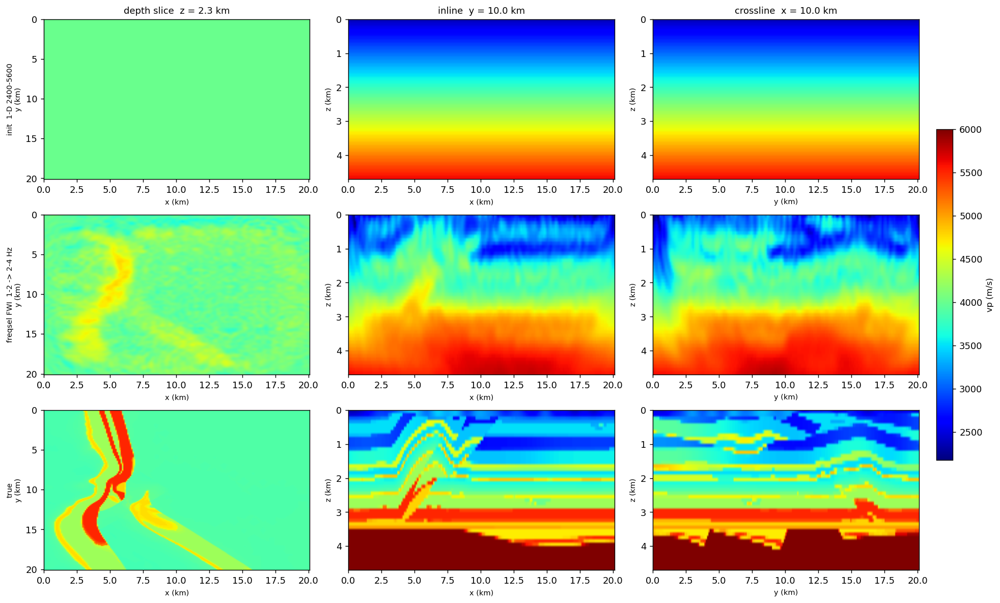

# Frequency-selection FWI, 3-D

```bash
RUNS=examples/synthetic/sweep_runs
sweep-tasks run examples/synthetic/13_forward_freqsel_nodes_3d.yaml
sweep-tasks extract-coeff $RUNS/forward_freqsel_nodes_3d --n-p 16000 --k-lo 64 --k-hi 128 -o $RUNS/coeff_3d_1_2hz.npz
sweep-tasks extract-coeff $RUNS/forward_freqsel_nodes_3d --n-p 8000  --k-lo 64 --k-hi 128 -o $RUNS/coeff_3d_2_4hz.npz
sweep-tasks run examples/synthetic/14_fwi_overthrust_freqsel_3d.yaml
```

The [2-D pipeline](freqsel-2d.md) on SEG/EAGE Overthrust, where the encoding
changes what is affordable: 64 nodes fire together out of 65 bins, every
iteration.

**Needs** network on the first run — `overthrust:3d-acoustic` is a ~175 MB
download cached under `~/.cache/sweep-datasets` (CC-BY-4.0). On a cluster whose
compute nodes have no outbound network, run 13 once on a login node or
pre-stage `$SWEEP_DATASETS_CACHE`. 14 also needs a **≥ 48 GB GPU** as written:
the first rung's 64 s analysis window is 19,250 time steps and peaks at
43.8 GB even with boundary saving. On a 40 GB card use
`boundary: { storage: cpu }`.

## 13 — record the node gathers

`geometry.kind: grid` is the 3-D counterpart of `kind: line`: a rectangular
patch of sources and one of receivers from start/stop/step rules, so a
2401-channel survey is six lines of YAML instead of 2401. 64 nodes on an 8 × 8
patch at 2.4 km, 2401 surface positions on a 49 × 49 patch at 400 m.

`downsample: 4` takes the 801 × 801 × 187 model at 25 m to 201 × 201 × 47 at
100 m — 20.1 × 20.1 × 4.7 km, 1.9 M cells. `record.npy` is 1.84 GB.

**Reference (RTX 6000 Ada, seed 0): forward 96 s, extractions 23 s and 12 s.**

## 14 — invert

**Reference: 35 min**, RMSE 644.1 → 512.3, `r` = 0.309.



The thrust comes out in the right place — the depth slice recovers the curved
high-velocity ridge at x ≈ 5 km and its branch, and the basement topography at
3–3.5 km tracks the truth — and it is visibly smooth.

That smoothness is the band, not the tuning. The grid caps it: 2179 m/s at
100 m cells puts five points per wavelength at **4.4 Hz**, and 2–4 Hz at
4000 m/s is a 1–2 km wavelength, so half-wavelength resolution is 500 m – 1 km
against tens of metres of true layering. Where the 2-D ladder climbs to 10 Hz
on a 12.5 m grid, this one has nowhere to go. The only lever is a finer grid —
`downsample: 2` doubles the ceiling and costs about 16× per iteration, which is
a multi-GPU job rather than an example.

A cold start matters even more here than in [03](fwi-multiscale.md), for a
reason that is easy to get backwards. Starting 14 from `smooth_sigma_cells: 6`
— the standard-looking choice — makes the example **badly posed**: 600 m of
smoothing is already correct everywhere a 1–4 Hz band can see, so there is
nothing to gain and the run degraded a good model (RMSE 402.6 → 431.5). The
1-D ramp it uses instead leaves real low-wavenumber error (503.0) for those
frequencies to work on.
