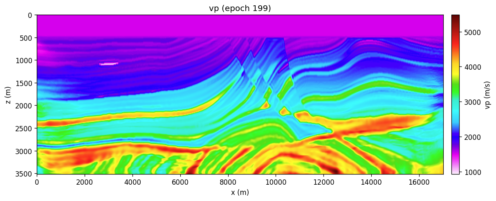

# FWI, multiscale

```bash
sweep-tasks run examples/synthetic/03_fwi_marmousi_multiscale.yaml
```

Same grid, geometry and wavelet as [01](forward.md) and
[02](fwi-single.md). What changes is the **start**: a 1-D ramp with no lateral
structure whatsoever, so nothing about the answer leaks in through the model. A
single broadband band cycle-skips from there; the four-stage `stages:` ladder
(2 → 5 → 10 Hz → broadband, 50 epochs each, each with its own bandpass and
`lr_scale`) is what makes it work.

**Reference (RTX 6000 Ada, seed 0), 4 × 50 epochs, 11.5 min:**

| after | RMSE vs true |
|---|---|
| init (1-D ramp 1500→4000, water pinned) | 473.7 |
| stage 1 — 0.5–2 Hz | 402.6 |
| stage 2 — 0.5–5 Hz | 347.6 |
| stage 3 — 0.5–10 Hz | 325.3 |
| stage 4 — broadband | **317.3** |

perturbation correlation `r` = 0.752; low-wavenumber RMSE (both smoothed by
σ = 8 cells) 184.9, a **42.5 % improvement** on the starting model.




## Why those rungs

The ladder is not a magic sequence. A stage cycle-skips where the two-way
traveltime error exceeds half a period, so the next rung must satisfy

```
f  <  1 / (2 |Δt|)
```

Measured on this setup, the 1-D start is **−160 ms** off at 2 km depth in the
flat-layered left half of the model. That forces the first rung below 3.1 Hz —
2 Hz here. One 2 Hz stage pulls the error down to about −50 ms, which clears
5 Hz (100 ms half-period), and so on up. Jumping straight from the 1-D start
to 5 Hz reproducibly wrecks the left half, while the right half — which starts
only +65 ms off — converges fine either way.

Two consequences worth internalising:

* **RMSE against the true model is a poor progress metric here.** It is
  dominated by thin-layer amplitudes FWI cannot resolve. Traveltime error and
  the perturbation correlation `r` track what the inversion is actually doing;
  RMSE rose through the stages in several configurations that were visibly
  improving the background.
* **A single 1-D gradient cannot suit both halves of Marmousi.** The left half
  wants a slower start, the right half a faster one, and `|Δt_left| +
  |Δt_right|` at 2 km is invariant (255 ms) whatever `vmax` you choose.
  Raising it only moves error from one half to the other.

## Why the wavelet has 2 s of lead-in

`wavelet.delay: 2.0` is sized by stage 1. Low-passing an 8 Hz Ricker to
0.5–2 Hz stretches its left lobe back about 2 s; with only 1 s of lead-in the
lobe is clipped at t = 0 and the step radiates a broadband floor (~1e-3) across
the whole spectrum, so the "2 Hz" stage is not actually band-limited. 2 s
drops that floor 5×.
