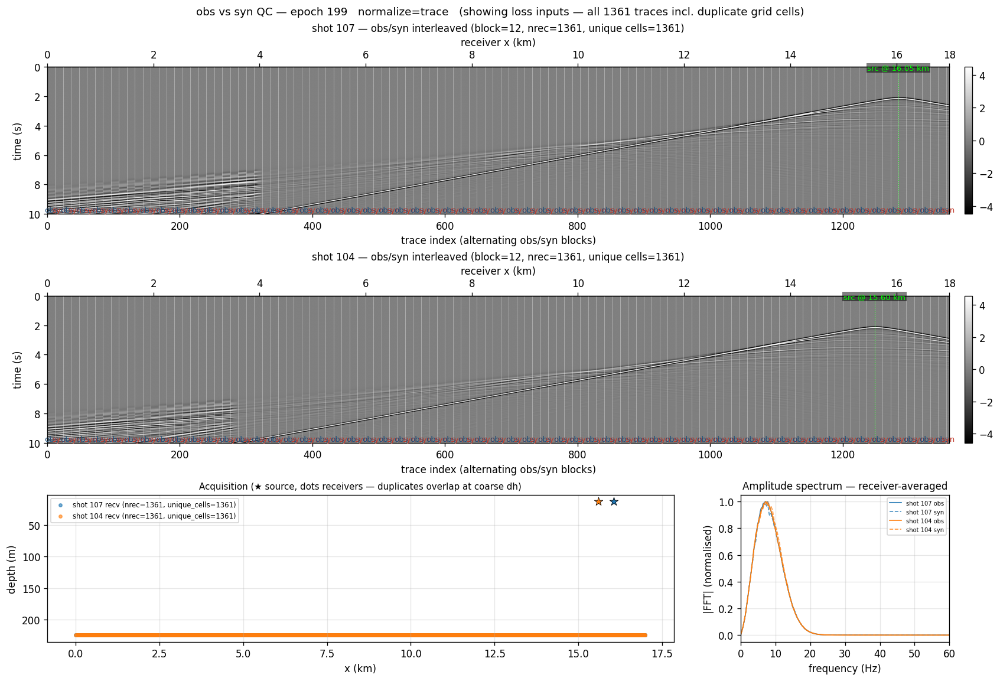

# FWI, single-scale

```bash
sweep-tasks run examples/synthetic/02_fwi_marmousi_single.yaml
```

FWI from `vp_smooth`, the low-pass-filtered true model. It keeps the right
depth trend, so a **single broadband band** converges without cycle-skipping.
Read this one first among the inversions: it shows the FWI task shape,
`obs.synthetic_from` (the observed data are synthesised from `vp_true` on the
fly, with the same grid, geometry and wavelet as [01](forward.md)), the
boundary-saving adjoint and the per-epoch QC — without the multiscale machinery
on top.

**Reference (RTX 6000 Ada, seed 0), 200 epochs, 29.6 min:**

| | |
|---|---|
| misfit | 1.592e-02 → 1.564e-04 (min, epoch 115) → 2.575e-04 |
| RMSE vs true | 357.3 (init) → **270.6** |
| perturbation correlation `r` | 0.700 |


The runner's obs/syn QC panel — interleaved gathers, the acquisition map, and
a receiver-averaged amplitude spectrum where obs and syn sit on top of each
other:



## Where the 30 minutes go

200 epochs × 16 shots is 3200 shot gradients, each a 10 s record at dt = 1 ms
(10,000 steps). With `strategy: boundary` the backward pass re-propagates the
forward from the saved boundary, so each gradient is about three wavefield
sweeps. Run it on several GPUs to split the shots:

```bash
sweep-tasks run examples/synthetic/02_fwi_marmousi_single.yaml --nproc-per-node 4
```

## `batchsize` is a fraction, not a count

It is how many shots are drawn at random per optimizer step, so what matters
is `batchsize / nshots`. Keep it near ~15 %. Measured here: 114 shots with
`batchsize: 8` (7 %) gives RMSE 297, and `batchsize: 16` (14 %) gives 271 —
denser shots only pay off if the batch grows with them.
