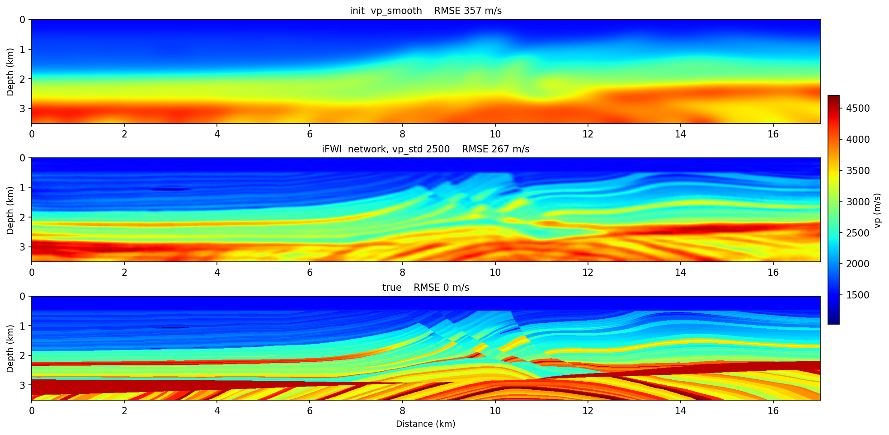

# iFWI — the model as a network

```bash
sweep-tasks run examples/synthetic/07_fwi_marmousi_inr.yaml
```

Same physics, same data, different **unknowns**. Instead of 382,441 velocity
cells, the unknowns are the 251,728 weights of a coordinate network — a hash
encoder feeding a SIREN — that is asked for `vp(x, z)` wherever the solver
needs it. The optimiser trains the weights; the network's own smoothness is the
regulariser. Everything about it lives in the `reparam:` block.

It starts from `vp_smooth`, the same start as [02](fwi-single.md), and runs
the four-stage ladder and batch size of [03](fwi-multiscale.md) for the same
200 epochs. The network predicts a *perturbation* added to the start
(`direct_velocity: false`), so it begins near zero and the run begins exactly
where 02 does.

**Reference (RTX 6000 Ada, seed 0), 4 × 50 epochs, 13.9 min:**

| | grid ([02](fwi-single.md)) | network (07) |
|---|---|---|
| RMSE vs true | **270.6** | 267.3 |
| perturbation `r` | 0.700 | 0.687 |
| free parameters | 382,441 cells | **251,728 weights** |

A wash on accuracy, which is the honest result. What the parametrisation buys
is a model with fewer degrees of freedom than the grid it renders onto.



## The one parameter that decides whether it works

`reparam.vp_std`. The network renders `vp = init + raw * vp_std`, and `raw`
grows only as fast as `lr × steps` lets it — so `vp_std` is the effective step
size in m/s, and `lr` is not. Size it to the perturbation **the data needs**,
not to an intuition about small perturbations. Here the true update has rms
357 m/s and a range of ±1400:

| `vp_std` | 300 | 600 | 900 | 1500 | 2500 | 4000 |
|---|---|---|---|---|---|---|
| RMSE | 325.4 | 309.3 | 291.8 | 276.9 | **267.3** | 264.2 |
| `r` | 0.467 | 0.543 | 0.609 | 0.659 | **0.687** | 0.696 |

At 300 — the obvious first guess — the network saturates at ±180 m/s of update
against the ±1400 the data is asking for, and the deep section barely moves
(RMSE improves 1.2 % below 2.5 km). The curve flattens around 2500.
