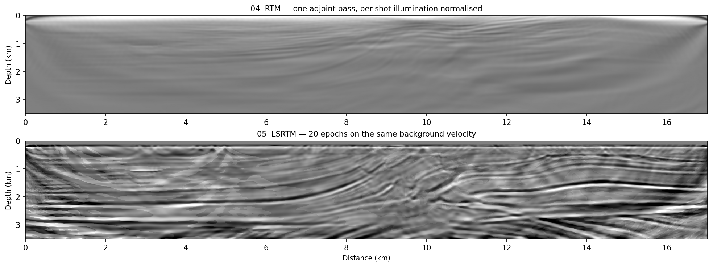

# RTM and LSRTM

```bash
sweep-tasks run examples/synthetic/04_rtm_marmousi.yaml
sweep-tasks run examples/synthetic/05_lsrtm_marmousi.yaml
```

The FWI examples solve for velocity. These two hold it fixed at `vp_smooth`
and ask a different question: **where are the reflectors?**

| | what it solves | passes | reference (RTX 6000 Ada, seed 0) |
|---|---|---|---|
| 04 RTM | nothing — one adjoint pass | 1 | 164 s |
| 05 LSRTM | reflectivity, linear in the unknown | 20 epochs | 89 s, misfit 1.458e-2 → 1.374e-2 |

RTM cross-correlates the source wavefield with the back-propagated residual and
stacks over shots. It is fast and it is *not* an inversion, so the image carries
the acquisition footprint and the source signature. LSRTM iterates on that image
until the demigrated data matches the observed scattered field — same physics,
but deconvolved and better balanced. Neither touches the non-linearity that
makes FWI hard, because the background velocity never moves.



Both are plotted on the same signed grey scale. RTM gets the reflectors in one
pass; LSRTM sharpens them and evens out the amplitudes, which is what inverting
rather than migrating buys.

## 04 — what the RTM output directory holds

04 writes its image three ways — raw (`rtm_image.npy`),
illumination-normalised and per-shot normalised — plus a depth-tapered
Laplacian post-filter applied to each, with a PNG for each, so you can see what
each knob does rather than take it on trust. That is why the output directory
has twenty-odd files for one run.

## 05 — LSRTM

`equation: AcousticLSRTM` is the Born-scattering variant of the acoustic
equation: the background velocity stays fixed and the unknown is reflectivity.
The runner builds the scattered data itself as `forward(true) − forward(bg)`,
so obs is purely the reflected wavefield. Reflectivity is O(0.1), not O(1000)
like vp, which is why `optimizer.lr` is 0.02 and `reflectivity_bounds` clips it
to ±0.3. It writes `output/reflectivity.npy`, `loss.npy` + `loss.png`, and a
reflectivity snapshot every `show_every` epochs under `output/epochs/`.

> **The LSRTM misfit is not monotone**, and that is expected rather than a bug:
> epochs 0 / 9 / 19 read 1.458e-2 / 1.393e-2 / 1.505e-2 before settling at
> 1.374e-2. The shot batch is redrawn every step, so consecutive epochs are
> measured on different data.
