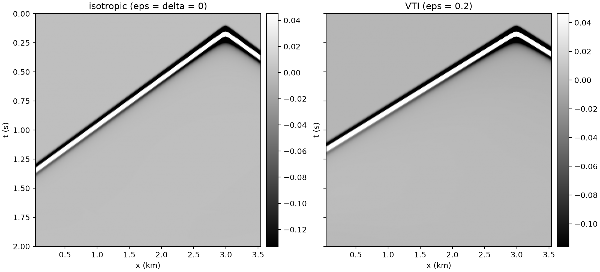
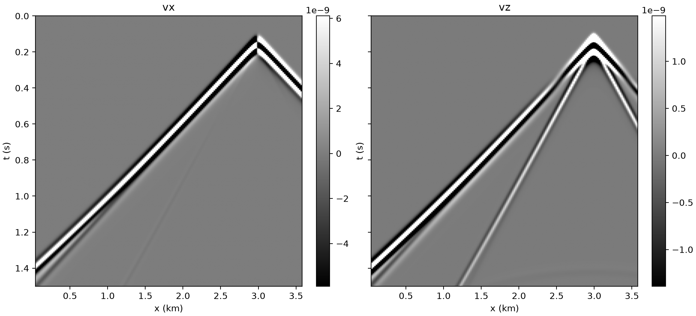

# Anisotropic and elastic

Every other example pins `equation: Acoustic` or `Acoustic3D` — two of the 39
equations sweep-solver 0.3.5 registers, and two of only three that take `vp`
alone. These two show the pattern for all the rest:

* **`models:` must list every model the equation declares**, by name, and the
  names are not guessable. Ask [15](introspect.md) rather than assume:
  `AcousticVTI` wants `[vp, epsilon, delta]`, `Elastic` wants `[vp, vs, rho]`,
  `ElasticTTI` wants eight. A missing or misspelt name is an error at setup,
  not a silent default.
* **`source_type` / `receiver_type` are per-equation too.** The acoustic `h1`
  (pressure) still applies to VTI because it is pseudo-acoustic, but the
  velocity-stress elastic equation has no `h1` at all. Get it wrong and the
  runner fails at setup with the full list of valid values.

Both build their models in memory, need no dataset, and run on `impl: eager`.

## 16 — VTI anisotropy

```bash
sweep-tasks run examples/synthetic/16_forward_anisotropic.yaml
```

A wavefront whose velocity depends on the direction it travels — which no
isotropic example can show. Thomsen's parameters are defined so that zero means
isotropy, so re-running with `epsilon` and `delta` both 0 is a clean control:

```bash
sweep-tasks run examples/synthetic/16_forward_anisotropic.yaml \
    --override task_id=aniso_iso \
    --override 'models=[{"name":"vp","constant":2500.0,"shape":[200,360]},
                        {"name":"epsilon","constant":0.0,"shape":[200,360]},
                        {"name":"delta","constant":0.0,"shape":[200,360]}]'
```



Same `vp`, same geometry: the VTI first break arrives earlier, and the gap
grows with offset. Measured on the far-offset trace (1740 m) of shot 2:

| | first break |
|---|---|
| isotropic, ε = δ = 0 | 787 ms |
| VTI, ε = 0.2 | 680 ms — ratio 1.157 |

The horizontal P velocity is `vp·sqrt(1 + 2ε)` = 1.183 `vp`, so 1.157 is the
right answer rather than a near miss: at 1740 m with the source at 40 m and the
receivers at 80 m the ray is not yet horizontal, so the measured speed-up must
come in below the asymptote. `delta` controls the near-vertical curvature (the
NMO velocity `vp·sqrt(1 + 2δ)`) rather than the horizontal asymptote.

**Reference (`--override device=cpu`, 8 threads): 37.6 s**, record
`(3, 2000, 176, 1)`.

## 17 — elastic: P and S in one record

```bash
sweep-tasks run examples/synthetic/17_forward_elastic.yaml
```

An explosive source in the elastic equation is equal normal stresses,
`source_type: [sxx, szz]`, and the natural receivers are the two
particle-velocity components `[vx, vz]` — so the record's last axis is 2.



Two arrivals where the acoustic examples have one: the fast P and, steeper,
the S wave. Measured on the far trace of shot 2 (`vz`), the two strongest
arrivals land at 598.5 ms and 954.5 ms, a ratio of 1.59. The Poisson-solid
`vp/vs` is 1.73, and 1.59 is right rather than a near miss: the models are
gradients, so P and S turn at different depths and average different velocities
on the way. Flatten the three gradients to constants and it goes to 1.73. At
the first break `vx` carries 4–7× the amplitude of `vz`, which is what a
near-horizontal direct P should do.

Set `physics.free_surface: true` and a third, slower, dispersive arrival
appears — the Rayleigh wave — which does not exist in an acoustic model at all.

There is no `pml_type:` in the file, on purpose. Elastic is solved on a
staggered grid, so its PML is the staggered `cpmls`; left unset, every equation
gets the PML it ships, and naming another is refused.

**Reference (`--override device=cpu`, 8 threads): 61.8 s**, record
`(3, 3000, 178, 2)`.
