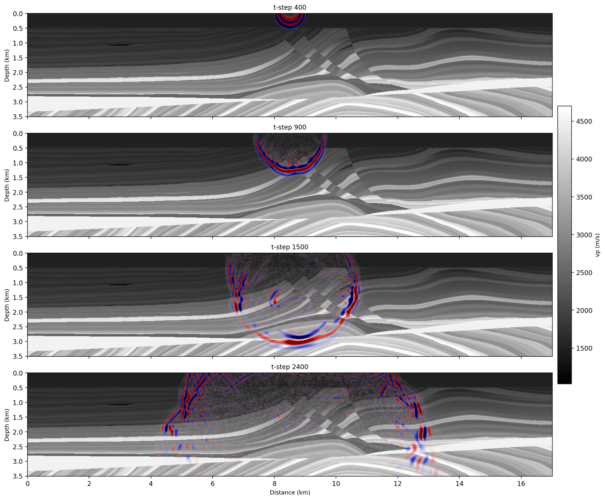

# Wavefield snapshots

```bash
sweep-tasks run examples/synthetic/06_wavefield_snapshots.yaml
```

`task_type: wavefield` dumps the pressure field at chosen time steps
(`snapshot_times:`) instead of only recording at receivers — the fastest way to
see a physics flag rather than reason about it. It writes `output/record.npy`,
`output/snapshots.npy` and `output/snapshots.png`. It runs on `impl: eager`,
because snapshot capture needs the wavefield returned to Python.

**Reference: 18 s**, snapshots at steps 400 / 900 / 1500 / 2400.



The velocity model is drawn underneath and the wavefield laid on top with a
transparency taken from its own amplitude, so you can see what the wave is
travelling through. Reading down: the source rings in the water layer, the
front reaches the seabed, then the two near-vertical scattering trains at
x ~ 7 km and x ~ 11 km line up with the fault zone, and by 2.4 s a strong
surface multiple is bouncing along z = 0. Nothing reflects off the left and
right edges, which is the CPML doing its job.

## Try it: flip the free surface

With `free_surface: true` the snapshots show the downgoing wave, its
polarity-flipped ghost, and the surface multiples behind it. Set it to `false`
and re-run, and only the direct wavefront is left:

```bash
sweep-tasks run examples/synthetic/06_wavefield_snapshots.yaml \
    --override task_id=wavefield_nofs --override physics.free_surface=false
```
